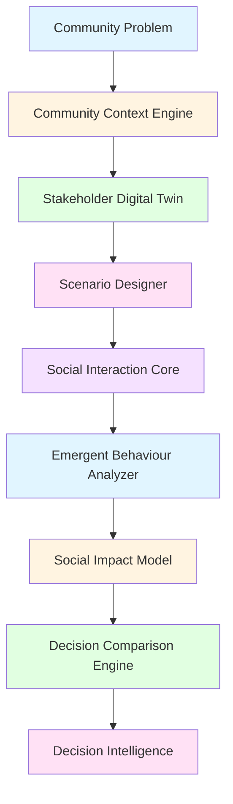

# MiroFish Community

## AI-Powered Social Decision Simulator

---

## Title Slide

**MiroFish Community**
AI-Powered Social Decision Simulator

A research-oriented framework for exploring community decision outcomes through multi-agent social simulation.

---

## Problem Statement

Communities and decision-makers often need to choose between competing interventions, policies, or strategies while having limited ability to anticipate heterogeneous stakeholder reactions and emergent social consequences.

Traditional approaches rely on:
- Surveys (static snapshots of opinion)
- Static statistics (historical data only)
- Individual opinions (lacking interaction dynamics)
- Simple sentiment analysis (missing emergent behaviour)

**Multi-agent social simulation** offers a way to explore possible outcomes by modeling:
- Heterogeneous stakeholder personas
- Dynamic social interactions
- Emergent community-level behaviour
- Scenario comparison under controlled conditions

**Important**: This framework simulates possible outcomes rather than guaranteeing future prediction. Simulated agents are not equivalent to real citizens.

---

## Objectives

This research project aims to:

1. **Construct a heterogeneous virtual community** — Build a digital twin representing diverse stakeholders with distinct personas, interests, and relationships
2. **Represent stakeholder preferences and relationships** — Model individual and group characteristics that influence decision-making
3. **Simulate community reactions to candidate decisions** — Explore how different interventions might unfold in social media environments
4. **Identify emergent social behaviour** — Derive community-level patterns from individual agent interactions
5. **Quantify social impact across scenarios** — Evaluate acceptance, consensus, polarization, conflict, and other impact dimensions
6. **Compare alternative decisions** — Provide side-by-side comparison of multiple candidate decisions
7. **Provide evidence-based decision support** — Generate decision intelligence with supporting evidence and uncertainty quantification
8. **Analyze uncertainty and limitations** — Document the limitations of simulated populations and the stochastic nature of LLM-based agents

---

## Research Methodology

The research follows a structured methodology:

```
Problem Definition
↓
Data Collection
↓
Context Modeling
↓
Stakeholder Modeling
↓
Scenario Design
↓
Multi-Agent Simulation
↓
Emergent Behaviour Analysis
↓
Social Impact Evaluation
↓
Scenario Comparison
↓
Decision Recommendation
```

**Input Data**: Community documents (PDF, MD, TXT) containing context, policies, and relevant information

**Model**: LLM-powered agent personas interacting on simulated social media platforms

**Simulation**: OASIS multi-agent social media environment (Twitter, Reddit, parallel)

**Metrics**: Quantitative measures of acceptance, consensus, polarization, conflict, equity, adoption, stability

**Output**: Decision intelligence with scenario comparison, recommendations, and uncertainty documentation

---

## Data Collection and Interpretation

### Data Sources

The system ingests:
- **PDF documents** — Policy documents, research papers, reports
- **Markdown files** — Structured documentation, meeting notes
- **TXT files** — Plain text descriptions, scenario notes

### Data Processing Pipeline

```
Raw Documents
↓
Text Extraction
↓
Context Extraction (LLM)
↓
Knowledge Representation (Ontology)
↓
Stakeholder Information (Entities)
↓
Simulation Input (Agent Profiles)
```

### Simulation Output Interpretation

- **Agent actions** — Posts, replies, likes, shares on social media
- **Interaction patterns** — Network formation, information diffusion
- **Temporal dynamics** — Round-by-round evolution of opinions
- **Community metrics** — Aggregated measures of consensus, polarization, conflict

**Note**: Simulation outputs are interpreted as scenario-analysis evidence, not as predictions of real-world behaviour.

---

## Flow of the Project



---

## Model

### A. Community Context Model

The Community Context Engine extracts structured representations from documents:

- **Entities** — People, organizations, locations, issues, events
- **Relationships** — Connections between entities (e.g., works_for, located_in, affects)
- **Stakeholders** — Identified community members and groups
- **Contextual information** — Background knowledge relevant to the decision problem

**Foundation**: Reuses existing OntologyGenerator and GraphBuilderService from MiroFish.

### B. Stakeholder / Agent Model

The Stakeholder Digital Twin generates heterogeneous agent personas:

- **Persona** — Detailed personality description
- **Role** — Social role (citizen, official, business, activist, etc.)
- **Interests** — Topics and issues the agent cares about
- **Preferences** — Decision-making tendencies
- **Beliefs** — Core beliefs and values
- **Goals** — Objectives the agent seeks
- **Behavioural tendencies** — Communication style, decision patterns
- **Relationships** — Social connections to other agents
- **Influence** — Relative influence in the community

**Agent count**: Configurable from 5 to 500 agents (default: 50)

**Foundation**: Reuses existing OasisProfileGenerator from MiroFish.

### C. Social Interaction Model

The Social Interaction Core uses OASIS for multi-agent simulation:

- **Platforms** — Twitter, Reddit, or parallel mode
- **Actions** — Create post, reply, like, share, follow
- **Rounds** — Configurable simulation rounds (default: 10)
- **Network dynamics** — Agents form connections through interactions

**Foundation**: MiroFish/OASIS (camel-oasis==0.2.5, camel-ai==0.2.78)

### D. Emergent Behaviour Model

The Emergent Behaviour Analyzer derives community-level patterns:

- **Consensus** — Agreement level across agents (0-1)
- **Polarization** — Opinion divergence (0-1)
- **Sentiment** — Overall sentiment (-1 to 1)
- **Conflict** — Disagreement intensity (0-1)
- **Information diffusion** — Spread rate of content (0-1)
- **Agent influence** — Distribution of influence across agents
- **Adoption** — Rate of support for interventions (0-1)

**Note**: Metrics are calculated from available simulation data. Some metrics use heuristics due to data limitations.

### E. Social Impact Model

The Social Impact Model evaluates consequences across dimensions:

- **Acceptance score** — Community acceptance of intervention (0-1)
- **Consensus score** — Level of agreement (0-1)
- **Polarization score** — Community division (0-1, lower is better)
- **Conflict score** — Conflict intensity (0-1, lower is better)
- **Equity score** — Fairness of impact distribution (0-1)
- **Adoption score** — Rate of adoption (0-1)
- **Stability score** — Predictability of outcomes (0-1)
- **Overall score** — Weighted combination of dimensions (0-1)

**Overall score formula**:
```
Overall = 0.20 × Acceptance
        + 0.15 × Consensus
        + 0.15 × (1 - Polarization)
        + 0.15 × (1 - Conflict)
        + 0.10 × Equity
        + 0.15 × Adoption
        + 0.10 × Stability
```

### F. Decision Comparison Model

The Decision Comparison Engine ranks scenarios:

- **Comparison table** — Side-by-side metric values
- **Rankings** — Scenarios ranked by each dimension
- **Recommendation** — Most socially viable option under simulated conditions

**Recommendation criteria**: Highest overall social viability score, with consideration of risks and confidence.

---

## Implementation / Technology Stack

### Core Technologies

- **Python**: 3.11 – 3.12
- **Package Manager**: uv
- **LLM Providers**: Ollama (qwen3:8b), Claude CLI, Codex CLI

### Foundational Libraries

- **MiroFish**: Multi-agent social simulation framework
- **OASIS**: Social media simulation environment (camel-oasis==0.2.5, camel-ai==0.2.78)
- **Kuzu**: Graph database for knowledge storage
- **Streamlit**: Web UI framework

### Research Layer Components

- **CommunityContextEngine**: Ontology and graph building
- **StakeholderDigitalTwin**: Agent profile generation
- **ScenarioDesigner**: Scenario management
- **EmergentBehaviourAnalyzer**: Behaviour pattern analysis
- **SocialImpactModel**: Impact evaluation
- **DecisionComparisonEngine**: Scenario comparison
- **DecisionIntelligenceEngine**: Comprehensive recommendation

### User Interfaces

- **CLI**: Command-line interface for automated workflows
- **Streamlit**: Interactive web UI for research workflow

---

## Experimental Setup

### Simulation Parameters

- **Agent count**: 5-500 (configurable, default: 50)
- **Simulation rounds**: 1-100 (configurable, default: 10)
- **Platforms**: Twitter, Reddit, or parallel
- **LLM model**: qwen3:8b (Ollama) or Claude/Codex CLI

### Data Requirements

- **Input documents**: PDF, MD, or TXT files providing community context
- **Problem statement**: Natural language description of decision problem
- **Candidate decisions**: 1-5 alternative interventions to compare

### Output Artifacts

Each simulation generates:
- **Knowledge graph** — Entities and relationships
- **Agent profiles** — Persona and stance information
- **Simulation timeline** — Round-by-round events
- **Behaviour metrics** — Quantitative behaviour analysis
- **Impact scores** — Social impact evaluation
- **Comparison results** — Scenario ranking and recommendation

---

## Agent Configuration

### Stakeholder Representation

Agents represent heterogeneous community stakeholders:

- **Individuals** — Citizens, residents, community members
- **Organizations** — Businesses, government agencies, NGOs
- **Groups** — Advocacy groups, professional associations
- **Experts** — Domain specialists, consultants

### Persona Generation

Each agent includes:
- **Name and role** — Social identity
- **Persona** — Detailed personality description
- **Interests** — Topics and issues they care about
- **Beliefs** — Core values and opinions
- **Goals** — Objectives they seek
- **Behavioural tendencies** — Communication and decision patterns

### Agent Count Control

The system respects the configured agent count:
- **Minimum**: 5 agents (for meaningful interaction)
- **Maximum**: 500 agents (performance consideration)
- **Default**: 50 agents (balanced for most scenarios)

The agent count flows through: UI input → Simulation config → Profile generation → OASIS execution → Results display.

---

## Social Behaviour Metrics

### Calculated Metrics

The system calculates the following metrics from simulation data:

1. **Consensus** — Level of agreement across agents (0-1)
2. **Polarization** — Opinion divergence (0-1)
3. **Sentiment** — Overall sentiment (-1 to 1)
4. **Conflict** — Disagreement intensity (0-1)
5. **Information diffusion** — Content spread rate (0-1)
6. **Agent influence** — Distribution of influence (0-1)
7. **Adoption** — Support rate for interventions (0-1)
8. **Equity** — Fairness of impact distribution (0-1)
9. **Stability** — Predictability of outcomes (0-1)

### Metric Calculation

Metrics are derived from:
- **Agent actions** — Posts, replies, likes, shares
- **Content analysis** — Sentiment extraction from posts
- **Network analysis** — Connection patterns and influence
- **Temporal analysis** — Evolution over simulation rounds

**Note**: Some metrics use heuristics due to data limitations. All metrics are based on simulated behaviour, not real-world data.

---

## Scenario Comparison

### Comparison Process

1. **Define candidate decisions** — Specify 1-5 alternative interventions
2. **Run simulations** — Execute simulation for each scenario
3. **Calculate impact scores** — Evaluate each scenario across dimensions
4. **Generate comparison table** — Side-by-side metric comparison
5. **Rank scenarios** — Order by overall score and individual dimensions
6. **Identify recommendation** — Select most socially viable option

### Comparison Output

```text
Scenario | Acceptance | Conflict | Consensus | Overall
---------|-----------|----------|-----------|--------
A        | 0.78      | 0.21     | 0.74      | 0.76
B        | 0.61      | 0.42     | 0.53      | 0.57
C        | 0.84      | 0.15     | 0.82      | 0.83
```

**Recommendation**: Scenario C is the most socially viable under the simulated conditions.

---

## Results / Evaluation

### Research Contribution

This project contributes:

1. **Community Digital Twin Framework** — Structured representation of community context and stakeholders
2. **Scenario-Based Decision Simulation** — Methodology for evaluating multiple candidate decisions
3. **Emergent Behaviour Analysis** — Techniques for deriving community-level patterns from agent interactions
4. **Social Impact Evaluation** — Multi-dimensional impact assessment framework
5. **Multi-Scenario Decision Comparison** — Systematic approach to comparing alternative decisions
6. **Decision Intelligence** — Comprehensive recommendation with uncertainty quantification

### Limitations

The system has several important limitations:

1. **Simulated agents are not real people** — LLM-based personas do not capture full human complexity
2. **Stochastic behaviour** — LLM responses vary, leading to different simulation outcomes
3. **Limited context** — Document-based context may not capture all relevant factors
4. **Simplified social model** — Social media simulation is a simplification of real social dynamics
5. **Heuristic metrics** — Some metrics use approximations due to data limitations
6. **No real-world validation** — Results have not been validated against actual outcomes

### Interpretation Guidelines

Results should be interpreted as:
- **Scenario-analysis evidence** — Insights about possible outcomes under specified conditions
- **Decision support information** — One input among many for decision-making
- **Not predictions** — Not guaranteed forecasts of real-world behaviour
- **Not recommendations** — Not substitutes for professional judgment or real-world validation

---

## Conclusions

The MiroFish Community framework demonstrates the feasibility of using multi-agent simulation to explore possible community-level outcomes and compare alternative decisions under simulated conditions.

**Key achievements**:
- Successfully integrated research-oriented layers on top of MiroFish/OASIS foundation
- Implemented comprehensive social impact evaluation across multiple dimensions
- Provided scenario comparison capabilities for decision support
- Maintained transparency about limitations and uncertainty

**Important caveats**:
- Results are based on simulated behaviour, not real human responses
- Simulated agents are not equivalent to actual community members
- Real-world validation is required before operational deployment
- Results should inform, not replace, human decision-making

---

## Future Scope

Potential future enhancements:

1. **Repeated simulation runs** — Aggregate multiple runs for statistical robustness
2. **Enhanced metrics** — Additional social impact dimensions
3. **Real-world validation** — Compare simulation results with actual outcomes
4. **Improved agent models** — More sophisticated persona and behaviour modeling
5. **Expanded platforms** — Additional social media platforms
6. **Interactive visualization** — Enhanced UI for exploring results
7. **API integration** — Programmatic access for research workflows

---

## References

### Foundational Technologies

- **MiroFish**: Multi-agent social simulation framework
  - Repository: https://github.com/666ghj/MiroFish
  - Original concept and design by 666ghj

- **OASIS**: Multi-agent social media simulation environment
  - Repository: https://github.com/camel-ai/oasis
  - Paper: CAMEL-AI Team. "OASIS: A Multi-Agent Social Media Simulation Framework"
  - Version: camel-oasis==0.2.5, camel-ai==0.2.78

### Key Libraries

- **Kuzu**: Graph database
  - Website: https://kuzudb.com/
  
- **Streamlit**: Python web app framework
  - Website: https://streamlit.io/

- **Ollama**: Local LLM inference
  - Website: https://ollama.com/

### Research Contribution

**This project's contribution** is the community decision-oriented framework, scenario comparison, social impact analysis, and decision intelligence layer built on the foundational MiroFish/OASIS technologies.

The research layers include:
- CommunityContextEngine
- StakeholderDigitalTwin
- ScenarioDesigner
- EmergentBehaviourAnalyzer
- SocialImpactModel
- DecisionComparisonEngine
- DecisionIntelligenceEngine

---

## License

[AGPL-3.0](LICENSE)

---

## Quick Start

### Prerequisites

- **Python**: 3.11 – 3.12
- **Package Manager**: [uv](https://docs.astral.sh/uv/)
- **LLM Engine** (choose one):
  - [Ollama](https://ollama.com/) (recommended for local/offline execution — default: `qwen3:8b`)
  - [Claude Code CLI](https://claude.ai/code) (`claude` binary on PATH)
  - [Codex CLI](https://github.com/openai/codex) (`codex` binary on PATH)

### Setup

```bash
# 1. Clone the repository and install dependencies
uv sync

# 2. Configure environment (copy example configuration)
# On macOS / Linux / PowerShell:
cp .env.example .env
# On Windows CMD:
# copy .env.example .env

# 3. Run diagnostics to verify your environment, provider, and model availability
uv run mirofish doctor
```

### Run a Simulation (CLI)

```powershell
uv run mirofish run --files demo_transit_policy.md --requirement "Predict how citizens and taxpayers will react to the fare-free weekend bus policy" --platform reddit --max-rounds 3 --agent-count 50
```

### Launch Streamlit UI

```bash
uv run streamlit run app/streamlit_app.py
```

The Streamlit UI provides the research workflow:
1. Community Problem
2. Stakeholder Configuration
3. Candidate Decisions
4. Simulation Parameters
5. Run Simulation
6. Emergent Behaviour
7. Social Impact
8. Scenario Comparison
9. Recommendation

---

## CLI Reference

### Commands

| Command | Description |
|---------|-------------|
| `mirofish doctor` | Run environment, `.env`, provider, and local model diagnostics |
| `mirofish run` | Execute end-to-end simulation pipeline and persist artifacts |
| `mirofish runs list` | List prior runs and high-level metadata (slim format) |
| `mirofish runs status <id>` | View full execution status and manifest for a run |
| `mirofish runs export <id>` | Resolve absolute paths to persisted run artifacts |

### Options for `mirofish run`

```text
mirofish run
  --files FILE [FILE ...]     One or more source files (pdf/md/txt) used to ground ontology and personas
  --requirement TEXT          Plain-English simulation requirement (e.g. "How will voters react to X?")
  --platform PLATFORM         Simulation platform: parallel (default), twitter, or reddit
  --max-rounds N              Max simulation rounds (default: 10)
  --agent-count N             Number of agents to simulate (5-500, default: 50)
  --wait                      Accepted for consistency (pipeline waits by default)
  --output-dir PATH           Custom directory to store run artifacts
  --json                      Emit machine-readable JSON on stdout
```

---

## Testing

```bash
# Run all tests
uv run python -m pytest tests/

# Run fast unit tests only
uv run python -m pytest tests/ -m "not integration"
```

---

## Architecture

```text
app/
  cli.py                  CLI entry point and command dispatch
  streamlit_app.py        Streamlit UI with research workflow
  config.py               Configuration loading & validation (.env)
  run_artifacts.py        Immutable RunStore artifact management
  visual_snapshots.py     Pure Python SVG visualization generator
  research/               Research-oriented architecture layers
    community_context_engine.py      Community context modeling
    stakeholder_digital_twin.py      Agent persona generation
    scenario_designer.py             Scenario management
    emergent_behaviour_analyzer.py   Behaviour pattern analysis
    social_impact_model.py           Impact evaluation
    decision_comparison_engine.py    Scenario comparison
    decision_intelligence_engine.py  Comprehensive recommendation
  core/                   WorkbenchSession, TaskManager, ResourceLoader
  resources/              Persistence adapters (projects, documents, graph, simulations, reports)
  tools/                  Composable pipeline steps (ontology, graph, prepare, run, report)
  services/               Business logic (graph builder, simulation runner, report agent, etc.)
  utils/                  LLM client, logging, file parsing
scripts/                  OASIS simulation runner scripts (subprocess)
tests/                    Pytest test suite
```<think>...</think>` reasoning tokens before downstream parsing.
