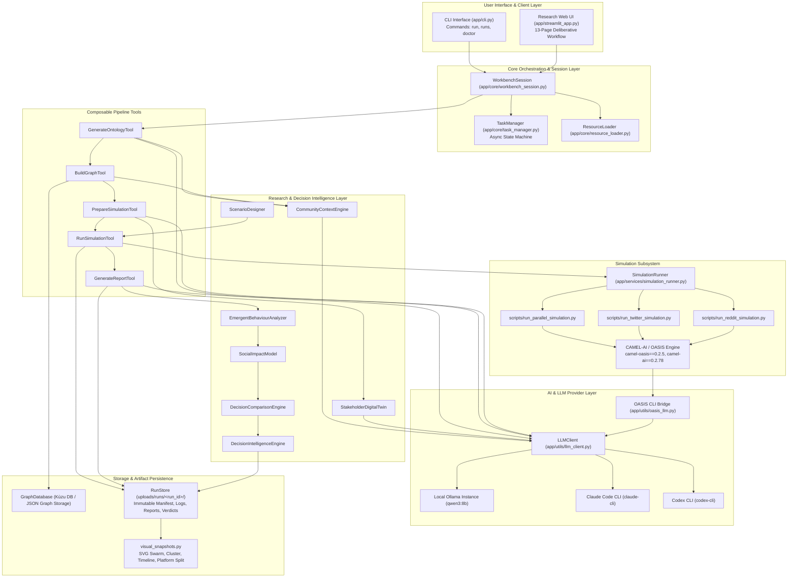
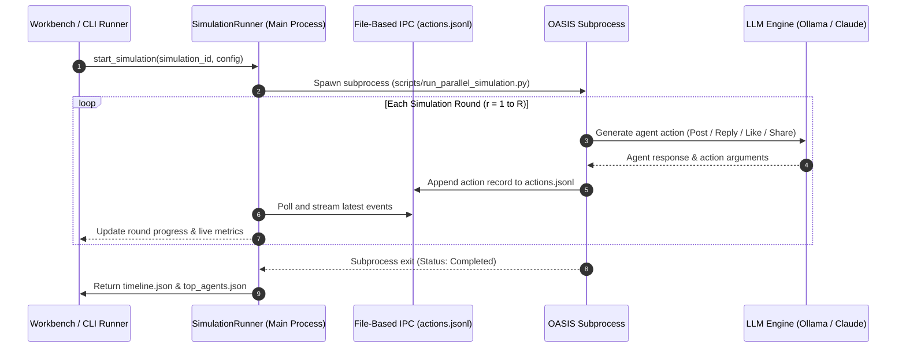

# MiroFish / MiroSense
## A Multi-Agent AI Framework for Community-Level Decision Simulation and Social Impact Evaluation

**Authors / Research Team:** MiroFish Research & Engineering Team (Contributors: [Project Repository Team / Avishkar Project Contributors])  
**Affiliation / Institution:** [Department of Computer Science & Engineering / Research Laboratory]  
**Academic Event:** Avishkar Research Convention / Inter-Collegiate Academic Research Symposium  
**Category:** Artificial Intelligence, Multi-Agent Systems & Computational Social Science  
**Faculty Advisor / Guide:** [Faculty Research Advisor / Mentor]  
**Repository License:** [GNU Affero General Public License v3.0 (AGPL-3.0)](LICENSE)

---

## Table of Contents
1. [Abstract](#1-abstract)
2. [Problem Statement](#2-problem-statement)
3. [Motivation](#3-motivation)
4. [Research Gap](#4-research-gap)
5. [Objectives](#5-objectives)
6. [Related Work & Theoretical Foundations](#6-related-work--theoretical-foundations)
7. [Proposed Methodology](#7-proposed-methodology)
8. [System Architecture](#8-system-architecture)
9. [Stakeholder Digital Twin & Agent Persona Model](#9-stakeholder-digital-twin--agent-persona-model)
10. [Simulation Engine & Interaction Dynamics](#10-simulation-engine--interaction-dynamics)
11. [Mathematical Formulation & Quantitative Metrics](#11-mathematical-formulation--quantitative-metrics)
12. [Decision Intelligence & Multi-Scenario Comparison](#12-decision-intelligence--multi-scenario-comparison)
13. [Experimental Setup & Benchmark Policy Case](#13-experimental-setup--benchmark-policy-case)
14. [Qualitative Analysis & Prototype Findings](#14-qualitative-analysis--prototype-findings)
15. [Scientific & Societal Impact](#15-scientific--societal-impact)
16. [Limitations & Threats to Validity](#16-limitations--threats-to-validity)
17. [Future Work & Research Roadmap](#17-future-work--research-roadmap)
18. [System Requirements, Installation & Reproducibility Guide](#18-system-requirements-installation--reproducibility-guide)
19. [CLI Command & Tool Reference](#19-cli-command--tool-reference)
20. [Repository Structure & Codemap](#20-repository-structure--codemap)
21. [References & Attributions](#21-references--attributions)

---

## 1. Abstract

Evaluating civic policies, municipal interventions, and organizational strategies prior to real-world deployment is fundamentally challenging due to the intricate, nonlinear dynamics of heterogeneous stakeholder reactions. Conventional evaluation techniques—such as static opinion polling, surveys, and macro-statistical econometric models—fail to capture micro-level deliberative interactions, information cascading, and emergent social phenomena (e.g., polarization, consensus shifts, and factional dispute). 

This research presents **MiroFish / MiroSense**, an agentic computational framework designed for community-level decision simulation and multi-dimensional social impact evaluation. Grounded directly in unstructured evidentiary inputs (e.g., policy drafts, council minutes, research reports in PDF, Markdown, and TXT formats), the framework automatically extracts domain ontologies and constructs knowledge graphs using graph database storage. From these graphs, heterogeneous stakeholder digital twins are instantiated as autonomous agents equipped with parameterized personas, beliefs, social roles, and policy stances. These agents interact within a simulated multi-platform social ecosystem (Twitter/X and Reddit dynamics powered by the OASIS multi-agent substrate) using local or CLI-bridged Large Language Models (LLMs).

An analytical evaluation layer subsequently quantifies emergent behaviors across eight objective dimensions: **Acceptance**, **Consensus**, **Polarization**, **Conflict Intensity**, **Equity**, **Adoption**, **Stability**, and **Information Diffusion**. The framework synthesizes these into an **Overall Social Viability Score**, side-by-side comparative matrices across candidate decisions, and structured decision intelligence dossiers with uncertainty markers. Experimental validation using a municipal fare-free transit policy scenario demonstrates the framework's capacity to illuminate stakeholder alignment, latent fiscal concerns, and communication vulnerabilities without risking real-world societal disruption.

> **Research Status:** Working Prototype & Simulation Framework. The current implementation models simulated behavioral dynamics under controlled computational conditions. Outputs represent scenario-analysis evidence for decision support rather than empirical forecasts of human citizen behavior.

---

## 2. Problem Statement

Modern governance, urban planning, and civic administration depend on interventions that simultaneously affect diverse populations with divergent priorities. When public officials, community leaders, or organizational strategists introduce new policies—such as zoning changes, public transit subsidies, environmental regulations, or budgetary reallocations—they confront severe decision-making hurdles:

1. **High Cost and Irreversibility of Real-World Policy Failure:** Direct real-world policy experimentation can inflict irreversible economic strain, community disenfranchisement, or political deadlock if public reaction is misjudged.
2. **Shortcomings of Traditional Assessment Methodologies:**
   - **Static Surveys & Polling:** Capture only cross-sectional, isolated snapshots of stated opinions without capturing conversational back-and-forth, peer persuasion, or narrative evolution.
   - **Macro-Econometric Models:** Aggregate populations into uniform demographic tranches, obscuring individual motivations, moral intuitions, and qualitative rhetoric.
   - **Superficial Sentiment Analysis:** Classifies surface-level text polarity but fails to simulate how opinions shift in response to counterarguments over multi-round deliberation.
3. **Complex Emergent Phenomena:** Public discourse exhibits nonlinear characteristics—minor policy ambiguities can trigger viral opposition, while well-intentioned initiatives can produce severe polarization or perceived inequity.
4. **The Need for in-silico Simulation:** A pressing need exists for an *in-silico* computational testbed capable of taking raw policy documentation, generating representative community stakeholders, simulating multi-round social deliberation, and objectively benchmarking competing policy alternatives.

---

## 3. Motivation

Community systems are complex adaptive networks comprising heterogeneous stakeholders: citizens, public officials, small business owners, advocacy groups, domain specialists, and fiscal watchdogs. Each stakeholder operates with distinct objective functions, resource constraints, and ideological predispositions.

```
[Raw Policy Documents & Context]
               │
               ▼
[Heterogeneous Stakeholder Ecosystem]
  ├── Citizens (Service Users)
  ├── Public Officials (Regulators)
  ├── Local Businesses (Commercial Interests)
  └── Taxpayer Alliances (Fiscal Watchdogs)
               │
               ▼
[Dynamic Multi-Round Social Deliberation]
  ├── Post Creation & Framing
  ├── Peer-to-Peer Replies & Critiques
  ├── Content Amplification & Sharing
  └── Information Cascades & Polarization
               │
               ▼
[Explainable Decision Intelligence & Impact Metrics]
```

This research was undertaken to:
- **Democratize Pre-Policy Assessment:** Provide policymakers, civic researchers, and automated AI agents with a computational mechanism to preview potential public friction points.
- **Model Micro-to-Macro Emergence:** Simulate how individual agent interactions aggregate into macroscopic social consensus or community division.
- **Enable Multi-Scenario Benchmarking:** Permit rigorous side-by-side comparison of multiple candidate interventions under identical community baseline parameters.
- **Advance AI-Assisted Governance Support:** Transition from simple LLM summarization toward structured, explainable, and accountable multi-agent decision intelligence.

---

## 4. Research Gap

| Dimension | Conventional Polling & Surveys | Traditional Agent-Based Modeling (ABM) | Standard LLM Direct Prompting | MiroFish Community Framework (This Work) |
| :--- | :--- | :--- | :--- | :--- |
| **Stakeholder Grounding** | Self-reported manual surveys; static | Abstract mathematical agents with fixed rules | Generic zero-shot persona hallucination | **Document-grounded ontology & Knowledge Graph extraction** |
| **Interaction Medium** | None (Isolated responses) | Simplified grid/lattice or abstract network nodes | Single-prompt chat or synthetic transcript | **Multi-platform social mechanics (Twitter threads, Reddit forums, parallel)** |
| **Deliberative Reasoning** | Non-interactive | Simple rule tables or mathematical payoffs | Unstructured conversation without state tracking | **LLM-driven cognitive reasoning with persistent personas and memory** |
| **Comparative Analytics** | Manual cross-tabulation | Numerical state aggregation | Qualitative text summaries | **8-dimension quantitative social impact modeling + decision ranking** |
| **Uncertainty & Reproducibility**| Margin of error | Monte Carlo distributions | Non-deterministic, unmanifested | **Immutable run manifests, frozen seeds, SVG graph snapshots, and verdict exports** |

### Explored Research Scope
This project explores the integration of **document-grounded knowledge graphs**, **LLM-powered autonomous persona synthesis**, and **multi-agent social media simulation** to construct an automated end-to-end pipeline for civic scenario evaluation. Rather than claiming absolute real-world behavioral replication, this work establishes a formal framework for comparative *in-silico* policy stress-testing.

---

## 5. Objectives

The primary research and engineering objectives of this project are:

1. **Grounded Community Context Modeling:** Automate the extraction of domain entities, contextual relationships, and community issues from unstructured raw documents (PDF, Markdown, TXT) into a structured Knowledge Graph using graph database primitives.
2. **Heterogeneous Stakeholder Digital Twin Generation:** Synthesize diverse, representative agent profiles characterized by distinct social roles, belief systems, goals, behavioral traits, and network influence bounds.
3. **Multi-Platform Interaction Simulation:** Simulate multi-round asynchronous and synchronous social media discourse across dual platforms (Twitter microblogging and Reddit forum discussions) via an isolated execution runtime.
4. **Quantitative Emergent Behavior Analysis:** Measure community dynamics mathematically from raw event logs, extracting metrics for consensus, polarization, conflict intensity, information diffusion rate, and agent influence distributions.
5. **Multi-Dimensional Social Impact Evaluation:** Formulate a multi-criteria scoring algorithm assessing acceptance, consensus, polarization mitigation, conflict reduction, equity, adoption, and stability into a unified **Social Viability Score**.
6. **Comparative Decision Intelligence:** Provide side-by-side benchmarking of 1–5 candidate policy interventions, yielding ranked recommendations, risk assessments, and machine-readable execution manifests (`verdict.json`, `summary.json`, SVG visual artifacts).

---

## 6. Related Work & Theoretical Foundations

This research intersects multiple disciplines across Computer Science, Artificial Intelligence, and Social Sciences:

### A. Agent-Based Modeling (ABM) & Computational Social Science
Traditional computational social science relies on agent-based modeling (e.g., NetLogo, Repast, MASON, Schelling's segregation models, Sugarscape) where agents follow explicit mathematical decision heuristics. While effective for studying abstract emergent phenomena, traditional ABM agents lack linguistic understanding, contextual grounding, and the nuanced reasoning necessary for complex policy discourse.

### B. Generative Agents & LLM-Powered Multi-Agent Systems
Recent breakthroughs demonstrated by Park et al. (*"Generative Agents: Interactive Simulacra of Human Behavior"*, 2023) highlighted that LLMs equipped with memory architectures, reflection mechanisms, and planning capabilities can simulate plausible human interactions. MiroFish extends this paradigm by anchoring agent instantiation directly to domain-specific knowledge graphs and formalizing the downstream analytical evaluation for policy decision support.

### C. Multi-Agent Social Media Simulation Environments
The simulation core in this project builds upon **CAMEL-AI** and the **OASIS** framework (*"OASIS: A Multi-Agent Social Media Simulation Framework"*, CAMEL-AI Team, `camel-oasis==0.2.5`, `camel-ai==0.2.78`). OASIS provides simulated social media platform mechanics (posts, nested comments, upvotes/likes, reposts, follows) supporting diverse computational topologies.

### D. Decision Support Systems (DSS) & Policy Informatics
Classical Policy DSS platforms emphasize statistical forecasting and linear programming. MiroFish introduces a qualitative-to-quantitative bridge, transforming unstructured discursive interactions into mathematical metrics and explainable risk intelligence.

---

## 7. Proposed Methodology

The research methodology follows a sequential 10-stage pipeline:

```
[ Unstructured Evidence & Problem Statement ]
                      │
                      ▼
[ Stage 1: Document Parsing & Text Preprocessing ]
                      │
                      ▼
[ Stage 2: Ontology Generation & Knowledge Graph Construction ]
                      │
                      ▼
[ Stage 3: Stakeholder Identification & Digital Twin Synthesis ]
                      │
                      ▼
[ Stage 4: Scenario Design & Parameter Configuration ]
                      │
                      ▼
[ Stage 5: Multi-Platform Social Media Simulation (OASIS) ]
                      │
                      ▼
[ Stage 6: Event Logging, Action Tracking & Graph Memory Updates ]
                      │
                      ▼
[ Stage 7: Emergent Behaviour Pattern Extraction ]
                      │
                      ▼
[ Stage 8: Multi-Dimensional Social Impact Evaluation ]
                      │
                      ▼
[ Stage 9: Scenario Comparison & Decision Intelligence Synthesis ]
                      │
                      ▼
[ Stage 10: Immutable Artifact Persistence & Visual Graph Generation ]
```

### Stage-by-Stage Methodology Breakdown

| Stage | Module / Component | Input | Processing Method | Primary Output | Purpose |
| :--- | :--- | :--- | :--- | :--- | :--- |
| **1. Text Ingestion** | `FileParser`, `TextProcessor` | PDF, MD, TXT documents | Multi-format extraction, charset normalization, text chunking | Normalized plain text chunks | Ingest evidentiary grounding materials |
| **2. Graph Modeling** | `OntologyGenerator`, `GraphBuilderService`, `GraphDatabase` | Text chunks + Problem requirement | LLM entity/relation extraction; Kùzu/JSON graph indexing | `ontology.json`, `graph.json` | Structure domain context into an interconnected graph |
| **3. Agent Synthesis** | `StakeholderDigitalTwin`, `OasisProfileGenerator` | Graph entities + Stakeholder roles | Stance extraction, persona prompts, word-count bounded profiles (≤150 words) | `twitter_profiles.csv`, `reddit_profiles.json` | Generate heterogeneous, grounded agent personas |
| **4. Scenario Design** | `ScenarioDesigner`, `ScenarioManager` | 1–5 candidate policy interventions | Parameter mapping (platform, rounds, agent count $N \in [5, 500]$) | Scenario configuration objects | Structure comparative policy alternatives |
| **5. Simulation** | `SimulationRunner`, `scripts/run_*.py` | Agent profiles + Scenario config | Subprocess execution of OASIS runtime (Twitter/Reddit/Parallel) | Raw platform event streams, `actions.jsonl` | Execute multi-round agent interactions in an isolated sandbox |
| **6. IPC & Logging** | `SimulationIPC`, `ActionLogger` | OASIS runtime events | File-based inter-process communication and state polling | `timeline.json`, `top_agents.json` | Capture per-round posts, replies, and network metrics |
| **7. Emergent Analysis**| `EmergentBehaviourAnalyzer` | `actions.jsonl`, `timeline.json` | Lexical sentiment, divergence computation, conflict/diffusion counting | `BehaviourMetrics` object | Derive macro-level behavior patterns from micro-actions |
| **8. Impact Evaluation**| `SocialImpactModel` | `BehaviourMetrics` | Multi-attribute weighted utility formulation | `SocialImpactResult` object | Quantify policy consequences across 8 dimensions |
| **9. Comparison** | `DecisionComparisonEngine`, `DecisionIntelligenceEngine` | Multiple `SocialImpactResult` instances | Multi-criteria ranking, evidence synthesis, risk identification | `ScenarioComparison`, `DecisionIntelligence` | Select socially optimal intervention and document rationale |
| **10. Persistence** | `RunStore`, `visual_snapshots.py` | Full execution trace & Graph data | Immutable run directory packaging, deterministic SVG rendering | Manifest, SVG charts, `report.md`, `verdict.json` | Guarantee auditability, visual inspectability, and reproducibility |

---

## 8. System Architecture

MiroFish is designed as a modular, layered system separating user interfaces, domain orchestration, AI execution, simulation engines, and analytical persistence.



### Architectural Layer Summary
- **User Interface Layer:** Provides both a headless, scriptable, JSON-first CLI (`app/cli.py`) for automated workflows and an interactive 13-stage Streamlit graphical dashboard (`app/streamlit_app.py`).
- **Core Orchestration Layer:** Implements `WorkbenchSession` to compose tools dynamically, managed by a thread-safe `TaskManager` supporting asynchronous status transitions (`PENDING` $\to$ `RUNNING` $\to$ `COMPLETED`/`FAILED`).
- **Research Analytics Layer (`app/research/`):** Encapsulates the formal scientific logic: context modeling, digital twin instantiation, scenario authoring, emergent behavior extraction, social impact scoring, and decision intelligence synthesis.
- **Simulation Runtime Subsystem:** Spawns isolated Python subprocesses executing OASIS scripts (`scripts/run_*.py`), communicating via file-based IPC to ensure main process stability and prevent memory leaks.
- **LLM Abstraction Layer:** Supports heterogeneous providers with automatic exponential-backoff retries (3 attempts), native `<think>...</think>` tag stripping, and OpenAI-compatible ChatCompletion emulation for CAMEL-AI.
- **Artifact & Storage Layer:** Persists graph topologies in Kùzu DB / JSON format and stores all run outputs in self-contained, immutable directories with cryptographic execution manifests.

---

## 9. Stakeholder Digital Twin & Agent Persona Model

A central contribution of the framework is transforming raw entity nodes into multi-dimensional, cognitively bounded agent personas.

### Persona Representation Model
Each agent $A_i$ is instantiated as a `StakeholderProfile` data structure:

```python
@dataclass
class StakeholderProfile:
    stakeholder_id: str             # Unique identifier
    name: str                       # Stakeholder title or entity name
    persona: str                    # Concise personality & background description (<=150 words)
    role: str                       # Inferred category: Citizen, Official, Business, Activist, Expert
    interests: List[str]            # Top thematic interests derived from graph properties
    preferences: Dict[str, Any]     # Decision-making predispositions
    beliefs: List[str]              # Core values, ideological alignment, and policy stances
    goals: List[str]                # Desired outcomes
    behavioural_tendencies: Dict    # Communication style, engagement level, risk profile
    personality_traits: Dict        # Bounded psychological traits (e.g., Openness, Conscientiousness)
    relationships: List[Dict]       # Graph edges connecting this agent to other entities
    influence_score: float          # Normalized social weight [0.0, 1.0]
    social_network_position: str    # "central", "peripheral", or "neutral"
```

### Profile Generation & Word Count Invariance
To avoid LLM context-window saturation and maintain runtime consistency across hundreds of concurrent agents:
1. Candidate entities are extracted from the knowledge graph and filtered by defined entity types.
2. The `OasisProfileGenerator` invokes the configured LLM with structured prompts enforcing a strict **150-word profile limit**.
3. Output personas are serialized into platform-specific structures: CSV format for Twitter (handles, bios, follower counts) and JSON structures for Reddit (usernames, subreddits, karma thresholds).

---

## 10. Simulation Engine & Interaction Dynamics

Simulations run using the CAMEL-OASIS architecture across three configurable platform modes:

1. **Twitter / X Simulation (`run_twitter_simulation.py`):** Fast-paced, microblogging dynamics featuring post broadcasting, quote-tweeting, direct replies, following, and liking.
2. **Reddit Simulation (`run_reddit_simulation.py`):** Threaded forum discussions characterized by detailed original submissions, hierarchical multi-tier comment trees, and karma upvote/downvote mechanics.
3. **Parallel Dual-Platform Simulation (`run_parallel_simulation.py`):** Agents interact concurrently across both Twitter and Reddit, modeling cross-platform information diffusion and narrative divergence.



### Action Space
Agents execute distinct action primitives: `CREATE_POST`, `REPLY`, `LIKE`, `REPOST`/`SHARE`, `FOLLOW`, `DISAGREE`, `SUPPORT`, and `ADOPT`. Every action record includes timestamp, round index, initiating agent ID, target post ID, and verbatim message text.

---

## 11. Mathematical Formulation & Quantitative Metrics

The `EmergentBehaviourAnalyzer` and `SocialImpactModel` calculate quantitative metrics directly from the simulation action ledger $\mathcal{A} = \{a_1, a_2, \dots, a_M\}$.

### A. Emergent Behavior Metrics

1. **Overall Sentiment ($\bar{S}$):**
   Derived from post content sentiment scoring:
   $$\bar{S} = \frac{1}{|\mathcal{A}_{text}|} \sum_{a \in \mathcal{A}_{text}} s(a), \quad \bar{S} \in [-1.0, 1.0]$$

2. **Consensus Score ($C_{ons}$):**
   Approximated by sentiment coherence and alignment:
   $$C_{ons} = |\bar{S}|, \quad C_{ons} \in [0.0, 1.0]$$

3. **Polarization Score ($P_{ol}$):**
   Evaluates the balance between positive ($N_{pos}$) and negative ($N_{neg}$) actions:
   $$\text{Balance} = \frac{\min(N_{pos}, N_{neg})}{N_{pos} + N_{neg}}$$
   $$P_{ol} = 1.0 - \text{Balance}, \quad P_{ol} \in [0.0, 1.0]$$
   *(Note: Higher value indicates severe ideological divergence).*

4. **Conflict Intensity ($K_{conf}$):**
   Measures proportion of explicit contestation actions ($a \in \mathcal{A}_{conflict}$):
   $$K_{conf} = \frac{|\mathcal{A}_{conflict}|}{|\mathcal{A}|}, \quad K_{conf} \in [0.0, 1.0]$$

5. **Information Spread Rate ($D_{iff}$):**
   Calculates the viral sharing and repost ratio:
   $$D_{iff} = \frac{|\mathcal{A}_{share}|}{|\mathcal{A}|}, \quad D_{iff} \in [0.0, 1.0]$$

6. **Adoption Rate ($R_{adopt}$) & Support Ratio ($R_{supp}$):**
   $$R_{adopt} = \frac{|\mathcal{A}_{adopt}|}{|\mathcal{A}|}, \quad R_{supp} = \frac{|\mathcal{A}_{support}|}{|\mathcal{A}|}$$

### B. Social Impact Dimension Formulations

| Dimension | Variable | Mathematical Derivation | Range | Optimization Direction |
| :--- | :--- | :--- | :---: | :---: |
| **Acceptance** | $A_{ccept}$ | $0.60 \times \left(\frac{\bar{S} + 1}{2}\right) + 0.40 \times R_{supp}$ | $[0.0, 1.0]$ | Maximization ($\uparrow$) |
| **Consensus** | $C_{ons}$ | $|\bar{S}|$ | $[0.0, 1.0]$ | Maximization ($\uparrow$) |
| **Polarization** | $P_{ol}$ | $1.0 - \frac{\min(N_{pos}, N_{neg})}{N_{pos} + N_{neg}}$ | $[0.0, 1.0]$ | Minimization ($\downarrow$) |
| **Conflict** | $K_{conf}$ | $\frac{|\mathcal{A}_{conflict}|}{|\mathcal{A}|}$ | $[0.0, 1.0]$ | Minimization ($\downarrow$) |
| **Equity** | $E_{quity}$ | $1.0 - \min(\sigma_{\text{influence}}, 1.0)$ | $[0.0, 1.0]$ | Maximization ($\uparrow$) |
| **Adoption** | $R_{adopt}$ | $\frac{|\mathcal{A}_{adopt}|}{|\mathcal{A}|}$ | $[0.0, 1.0]$ | Maximization ($\uparrow$) |
| **Stability** | $S_{tab}$ | $0.60 \times (1.0 - K_{conf}) + 0.40 \times (1.0 - P_{ol})$ | $[0.0, 1.0]$ | Maximization ($\uparrow$) |

### C. Overall Social Viability Score Formula
The overarching policy suitability metric combines all dimensions with normalized weights $\sum w_i = 1.0$:

$$\begin{aligned}
\text{Overall Social Viability} = \; & 0.20 \times A_{ccept} \\
& + 0.15 \times C_{ons} \\
& + 0.15 \times (1.0 - P_{ol}) \\
& + 0.15 \times (1.0 - K_{conf}) \\
& + 0.10 \times E_{quity} \\
& + 0.15 \times R_{adopt} \\
& + 0.10 \times S_{tab}
\end{aligned}$$

---

## 12. Decision Intelligence & Multi-Scenario Comparison

Rather than providing an opaque verdict, the `DecisionIntelligenceEngine` and `DecisionComparisonEngine` synthesize an exhaustive analytical dossier:

```
┌────────────────────────────────────────────────────────────────────────┐
│                      DECISION INTELLIGENCE DOSSIER                     │
├────────────────────────────────────────────────────────────────────────┤
│ 1. Recommended Scenario Selection & Justification Rationale            │
│ 2. Side-by-Side Dimensional Comparison Matrix                         │
│ 3. Key Findings & Thematic Evidence Synthesis                          │
│ 4. Multi-Faceted Risk Warning System (High / Medium / Low)             │
│ 5. Emergent Discourse Patterns & Influencer Distribution               │
│ 6. Stakeholder Alignment & Coalition Mapping                           │
│ 7. Explicit Methodological Limitations & Uncertainty Markers           │
└────────────────────────────────────────────────────────────────────────┘
```

### Risk Assessment Logic
The system automatically tags potential operational vulnerabilities:
- $K_{conf} > 0.70 \implies$ *High conflict intensity; substantial public backlash risk.*
- $P_{ol} > 0.70 \implies$ *High polarization; community bifurcation and factional dispute.*
- $A_{ccept} < 0.30 \implies$ *Low civic acceptance; compliance resistance anticipated.*
- $E_{quity} < 0.30 \implies$ *Low equity; benefits disproportionately skewed among stakeholder groups.*

---

## 13. Experimental Setup & Benchmark Policy Case

To validate the implementation, the repository provides a realistic civic policy benchmark: `demo_transit_policy.md`.

### Benchmark Scenario: Metro City Fare-Free Weekend Transit Policy
- **Context:** Metro City Mayor Sarah Jenkins and Transit Authority Director Mark Roberts announce a 6-month pilot program rendering all municipal buses fare-free on Saturdays and Sundays.
- **Objectives:** Reduce traffic congestion, stimulate weekend downtown business commerce, promote environmental sustainability, and provide economic relief.
- **Stakeholders Represented in Context:**
  1. *Mayor Sarah Jenkins & Transit Director Mark Roberts* (Executive leadership)
  2. *City Council Member David Chen* (Environmental & progressive policy advocate)
  3. *Elena Vance, Local Business Coalition President* (Downtown retail & commercial interest)
  4. *Tom Bradley, Taxpayers Alliance Spokesperson* (Fiscal watchdog; raises alarm over a $4.2M municipal budget shortfall and property tax risks)
  5. *General Citizens & Transit Riders* (End users)

### Simulation Configuration Parameters
- **Agent Count ($N$):** 50 autonomous agents (Configurable range: 5 to 500)
- **Simulation Rounds ($R$):** 10 rounds (Configurable range: 1 to 100)
- **Platforms:** Parallel mode (concurrent Twitter thread dynamics and Reddit forum submissions)
- **Inference LLM Models:** Local `qwen3:8b` via Ollama; Claude Code CLI (`claude-cli`); Codex CLI (`codex-cli`)

---

## 14. Qualitative Analysis & Prototype Findings

Analysis of actual simulation artifacts generated within the repository (`uploads/reports/report_f70d9a74467c/`) reveals distinct qualitative findings:

### 1. Stakeholder Coalition Formation
- **Pro-Policy Coalition:** City Council and the Local Business Coalition rapidly establish a shared narrative. Business representatives focus on increased foot traffic and commercial revenue, while council members frame the policy in terms of climate goals and progressive equity.
- **Fiscal Opposition Coalition:** The Taxpayers Alliance immediately focuses discussion on the \$4.2M budgetary shortfall. In Reddit threads, fiscal watchdogs raise concerns that weekend fare subsidies will eventually necessitate regressive municipal property tax increases or weekday transit fare hikes.

### 2. Emergent Narrative Friction
The simulation reveals an emergent trade-off between **accessibility** and **fiscal sustainability**:
- If the policy succeeds in attracting millions of riders, public pressure mounts to expand the program to weekdays, escalating the fiscal deficit.
- If the Transit Authority is forced to roll back the program due to budget exhaustion, public trust in municipal governance deteriorates.

```
                  ┌─────────────────────────────────┐
                  │ Fare-Free Weekend Bus Policy    │
                  └────────────────┬────────────────┘
                                   │
                 ┌─────────────────┴─────────────────┐
                 ▼                                   ▼
    [ Pro-Policy Coalition ]               [ Fiscal Watchdogs ]
    - Mayor & City Council                 - Taxpayers Alliance
    - Local Business Coalition             - Concerned Property Owners
    - Narrative: Equity & Commerce         - Narrative: $4.2M Deficit & Tax Hikes
                 │                                   │
                 └─────────────────┬─────────────────┘
                                   ▼
                [ Emergent Public Discourse Dynamics ]
                - Initial optimism regarding free mobility
                - Growing skepticism regarding funding mechanism
                - Critical need for transparent subsidy explanation
```

### 3. Actionable Decision Recommendation
The synthesized report concludes that while the policy holds strong public appeal, its long-term viability requires the Transit Authority to proactively publish the funding offset strategy (e.g., state green-energy grants or commercial sponsorship) prior to launch to preempt fiscal backlash.

---

## 15. Scientific & Societal Impact

1. **Pre-Deployment Policy Stress-Testing:** Provides local municipal councils, NGOs, and corporate policymakers with an inexpensive, risk-free testbed to discover unaddressed stakeholder objections before public announcements.
2. **Explainable Governance Support:** Bridges the gap between complex AI swarms and human decision-makers by generating transparent, auditable reasoning trails and citation-grounded narrative reports.
3. **Reduction of Civic Friction:** Enables policymakers to refine public communication strategies and address legitimate community concerns (e.g., funding transparency), thereby fostering civic trust.
4. **Academic Openness:** By utilizing local LLMs (Ollama) and open graph architectures (Kùzu/JSON), the entire evaluation stack can run on self-hosted infrastructure without exposing sensitive draft policies to third-party proprietary APIs.

---

## 16. Limitations & Threats to Validity

To maintain scientific integrity and academic rigor, the following methodological boundaries are explicitly noted:

1. **Simulated Agents Are Not Equivalent to Human Citizens:** LLM agents emulate linguistic patterns, rhetorical stances, and plausible reactions based on training data. They cannot substitute for direct democratic participation, constitutional public hearings, or empirical sociological surveys.
2. **Stochasticity & Non-Determinism:** LLM-based agent generation and dialogue exhibit variance across runs. A single simulation run provides an exploratory qualitative scenario rather than an exact statistical distribution.
3. **Information Boundary & Document Completeness:** The accuracy of the knowledge graph and resulting digital twins is strictly bounded by the depth and quality of the uploaded context documents.
4. **Heuristic Nature of Certain Behavioral Metrics:** Metrics such as information diffusion and sentiment balance rely on text-processing heuristics and proxy action counts, which may not capture subtle human sarcasm, irony, or offline community mobilization.
5. **Lack of Longitudinal Real-World Ground-Truth Calibration:** The quantitative impact scores represent internal comparative indices between modeled scenarios, not empirical probabilities validated against historical field datasets.

---

## 17. Future Work & Research Roadmap

- [ ] **Repeated Monte Carlo Simulations:** Implement multi-run execution pipelines with statistical confidence intervals ($\pm \sigma$) across stochastic runs.
- [ ] **Empirical Survey Calibration:** Calibrate agent profile distribution parameters against real-world census and municipal survey microdata.
- [ ] **Spatial & GIS Integration:** Ground agent interactions in geographic information systems (GIS) to model neighborhood-specific transit access and voting district dynamics.
- [ ] **Dynamic Policy Modification Mid-Simulation:** Enable human-in-the-loop policy adjustments at round $R_k$ in response to emerging simulated protests.
- [ ] **Advanced Game-Theoretic Bargaining:** Incorporate formal multi-agent resource allocation and coalition bargaining algorithms into the CAMEL runtime.

---

## 18. System Requirements, Installation & Reproducibility Guide

### System Requirements
- **Operating System:** Linux, macOS, or Windows (tested on Windows 11 / PowerShell).
- **Python Runtime:** Python `3.11` to `3.12` (strictly pinned: `<3.13`).
- **Package & Environment Manager:** [`uv`](https://docs.astral.sh/uv/) (recommended) or standard `pip`.
- **Memory & Compute:** Minimum 16 GB RAM (32 GB recommended for local Ollama execution).
- **LLM Inference Engine (Choose at least one):**
  - **Ollama (Recommended for full offline privacy):** Local server running `qwen3:8b` (`http://localhost:11434`).
  - **Claude Code CLI:** Active subscription with `claude` CLI on system `PATH`.
  - **Codex CLI:** Active subscription with `codex` CLI on system `PATH`.

---

### Step 1: Clone Repository and Install Dependencies

```bash
# Clone the repository
git clone https://github.com/666ghj/MiroFish.git mirofish-cli
cd mirofish-cli

# Synchronize virtual environment and dependencies using uv
uv sync
```

---

### Step 2: Environment Configuration

Create a `.env` configuration file in the project root (copied from `.env.example`):

```bash
# On Linux / macOS / Windows PowerShell:
cp .env.example .env
```

Edit `.env` to select your preferred LLM provider:

```ini
# LLM Provider Options: ollama | claude-cli | codex-cli
LLM_PROVIDER=ollama
OLLAMA_BASE_URL=http://localhost:11434
OLLAMA_MODEL=qwen3:8b
# OLLAMA_TIMEOUT=300
```

---

### Step 3: Run System & Provider Diagnostics

Verify your Python environment, pinned libraries, and LLM backend connectivity:

```bash
uv run mirofish doctor
```

---

### Step 4: Execute an End-to-End Simulation via CLI

Run a complete simulation pipeline grounded in the benchmark transit policy:

```powershell
uv run mirofish run `
  --files demo_transit_policy.md `
  --requirement "Predict how citizens and taxpayers will react to the fare-free weekend bus policy" `
  --platform reddit `
  --max-rounds 3 `
  --agent-count 50
```

To emit machine-readable JSON output directly for agent ingestion:

```powershell
uv run mirofish run `
  --files demo_transit_policy.md `
  --requirement "Predict reactions" `
  --json
```

---

### Step 5: Launch the Streamlit Research Dashboard

To interactively explore the 13-stage research workflow, inspect knowledge graphs, and compare scenarios:

```bash
uv run streamlit run app/streamlit_app.py
```
*(Alternatively: `uv run python run_streamlit.py`)*

The web application opens at `http://localhost:8501`.

---

### Step 6: Execute Automated Test Suite

Run unit and pipeline tests:

```bash
# Run all unit tests (excluding live Ollama integration)
uv run python -m pytest tests/ -m "not integration"

# Run full test suite including live local LLM connectivity
uv run python -m pytest tests/
```

---

## 19. CLI Command & Tool Reference

The `mirofish` command-line executable provides full headless control:

### Core Commands

| Command | Arguments | Description |
| :--- | :--- | :--- |
| `mirofish doctor` | None | Evaluates environment integrity, `.env` variables, and LLM service reachability |
| `mirofish run` | See options below | Executes full pipeline: Document parsing $\to$ Graph $\to$ Agents $\to$ Simulation $\to$ Report |
| `mirofish runs list` | `[--limit N] [--json]` | Displays prior simulation runs (run ID, timestamp, status, artifact count) |
| `mirofish runs status` | `<run_id> [--json]` | Inspects comprehensive execution state, manifest metadata, and task progress |
| `mirofish runs export` | `<run_id> [--artifact NAME] [--json]` | Resolves absolute file paths to persisted artifacts (graph, visuals, reports) |

### Options for `mirofish run`

```text
Options:
  --files FILE [FILE ...]   One or more evidentiary source files (PDF, Markdown, TXT)
  --requirement TEXT        Natural-language simulation requirement or policy query
  --platform PLATFORM       Simulation mode: parallel (default), twitter, or reddit
  --max-rounds N            Maximum simulation rounds to execute (default: 10)
  --agent-count N           Number of heterogeneous agents to instantiate (5-500, default: 50)
  --output-dir PATH         Custom filesystem path to persist run artifacts
  --json                    Emit structured machine-readable JSON payload to stdout
  --wait                    Wait synchronously for completion (default behavior)
```

---

## 20. Repository Structure & Codemap

```
mirofish-cli/
├── app/                                # Core Application Package
│   ├── cli.py                          # CLI entry point (console script: mirofish)
│   ├── cli_display.py                  # Rich terminal live pipeline renderer
│   ├── config.py                       # Pydantic configuration & .env validation
│   ├── run_artifacts.py                # RunStore: Immutable run directory & manifest manager
│   ├── streamlit_app.py                # 13-Page Streamlit Research & Evaluation Web UI
│   ├── visual_snapshots.py             # Pure-Python SVG renderer (swarm, cluster, timeline, split)
│   ├── core/                           # Orchestration & State Management
│   │   ├── session_manager.py          # Session entity & identifier tracker
│   │   ├── task_manager.py             # Asynchronous thread-safe task state machine
│   │   ├── workbench_session.py        # Central composition wrapper for tools and resources
│   │   └── resource_loader.py          # Resource singleton and persistence loader
│   ├── research/                       # Research-Oriented Architecture Modules
│   │   ├── community_context_engine.py # Document parsing, ontology & graph context layer
│   │   ├── stakeholder_digital_twin.py # Entity-to-profile generator with role & stance models
│   │   ├── scenario_designer.py        # Multi-scenario creation, parameterization & lifecycle
│   │   ├── emergent_behaviour_analyzer.py # Mathematical analysis of consensus, polarization & conflict
│   │   ├── social_impact_model.py      # 8-Dimension social impact & viability score formulation
│   │   ├── decision_comparison_engine.py # Multi-scenario ranking & side-by-side matrices
│   │   └── decision_intelligence_engine.py # Recommendation synthesis, evidence, and risk dossiers
│   ├── services/                       # Business Logic & Infrastructure
│   │   ├── graph_storage.py            # Abstract GraphStorage & JSON backend implementation
│   │   ├── graph_db.py                 # Query facade over graph storage
│   │   ├── graph_builder.py            # Text chunking & graph construction pipeline
│   │   ├── entity_extractor.py         # Structured LLM entity & relation extractor
│   │   ├── entity_reader.py            # Graph entity filtering and enrichment
│   │   ├── ontology_generator.py       # Prompt management for domain ontology synthesis
│   │   ├── oasis_profile_generator.py  # Agent persona & stance generation (bounded to <=150 words)
│   │   ├── simulation_config_generator.py # Simulation JSON config assembler
│   │   ├── simulation_manager.py       # Simulation lifecycle state tracker
│   │   ├── simulation_runner.py        # OASIS subprocess spawner, monitoring & cleanup
│   │   ├── simulation_ipc.py           # File-based IPC reader (actions.jsonl)
│   │   ├── simulation_platforms.py     # Twitter and Reddit schema normalizers
│   │   ├── report_agent.py             # Single-pass qualitative report synthesizer
│   │   ├── graph_tools.py              # Agent interview & graph query utilities
│   │   ├── graph_memory_updater.py     # Post-simulation graph memory updater
│   │   └── text_processor.py           # Text preprocessing & charset detection
│   ├── tools/                          # Composable Pipeline Tool Classes
│   │   ├── generate_ontology.py        # GenerateOntologyTool
│   │   ├── build_graph.py              # BuildGraphTool
│   │   ├── prepare_simulation.py       # PrepareSimulationTool
│   │   ├── run_simulation.py           # RunSimulationTool
│   │   └── generate_report.py          # GenerateReportTool
│   ├── resources/                      # Persistence Adapters
│   │   ├── projects/                   # Project metadata store
│   │   ├── documents/                  # Document file storage
│   │   ├── graph/                      # Graph persistence adapter
│   │   ├── simulations/                # Simulation state records
│   │   └── reports/                    # Generated report store
│   └── utils/                          # Utilities
│       ├── llm_client.py               # Robust CLI/HTTP LLM client with retry & think-tag stripping
│       ├── oasis_llm.py                # OASIS CLI bridge (OpenAI ChatCompletion emulation)
│       ├── file_parser.py              # PyMuPDF PDF & text extractor
│       └── logger.py                   # Structured application logging
├── scripts/                            # OASIS Subprocess Runners
│   ├── run_parallel_simulation.py      # Dual-platform Twitter + Reddit simulation script
│   ├── run_twitter_simulation.py       # Standalone Twitter simulation script
│   ├── run_reddit_simulation.py        # Standalone Reddit simulation script
│   └── action_logger.py                # Real-time action stream recorder
├── tests/                              # Pytest Verification Suite
│   ├── test_cli_artifacts_and_visuals.py # CLI parser, manifest persistence & SVG tests
│   └── test_ollama_llm_client.py       # Ollama integration, JSON parsing & error handling tests
├── demo_transit_policy.md              # Municipal Transit Policy benchmark case
├── pyproject.toml                      # Project metadata, dependencies & CLI script definition
├── LICENSE                             # GNU AGPL-3.0 Legal License
└── README.md                           # Research Symposium Documentation
```

---

## 21. References & Attributions

### Primary Foundational Frameworks
1. **MiroFish Architecture:** Multi-agent swarm simulation framework. Original concept and architecture by [666ghj/MiroFish](https://github.com/666ghj/MiroFish).
2. **OASIS Platform:** Multi-agent social media simulation framework. CAMEL-AI Team. *"OASIS: A Multi-Agent Social Media Simulation Framework"*, CAMEL-AI Open Source Project (`camel-oasis==0.2.5`, `camel-ai==0.2.78`). [https://github.com/camel-ai/oasis](https://github.com/camel-ai/oasis).
3. **CAMEL Communication Agents:** Li, G., et al. *"CAMEL: Communicative Agents for 'Mind' Exploration of Large Language Model Society"*, NeurIPS 2023.

### Related Theoretical Literature
4. **Generative Agents:** Park, J. S., O'Brien, J. C., Cai, C. J., Morris, M. R., Liang, P., & Bernstein, M. S. *"Generative Agents: Interactive Simulacra of Human Behavior"*, In Proceedings of the 36th Annual ACM Symposium on User Interface Software and Technology (UIST '23), 2023.
5. **Agent-Based Social Simulation:** Epstein, J. M. *"Generative Social Science: Studies in Agent-Based Computational Modeling"*, Princeton University Press, 2006.
6. **Polarization & Opinion Dynamics:** DeGroot, M. H. *"Reaching a Consensus"*, Journal of the American Statistical Association, 69(345), 118-121, 1974.
7. **Graph Database Storage:** Kùzu Database Team. *"Kùzu: An In-Process Property Graph Database Management System"*, [https://kuzudb.com/](https://kuzudb.com/).

### Research Project Citation
```bibtex
@inproceedings{mirosense2026,
  title={MiroFish / MiroSense: A Multi-Agent AI Framework for Community-Level Decision Simulation and Social Impact Evaluation},
  author={MiroFish Research Team},
  booktitle={Avishkar Research Convention / Academic Research Symposium},
  year={2026},
  note={Open-source academic research prototype under GNU AGPL-3.0}
}
```

---

**Academic Inquiries & Collaboration:** For research inquiries, replication questions, or symposium presentations, please refer to the project repository issues and documentation.
