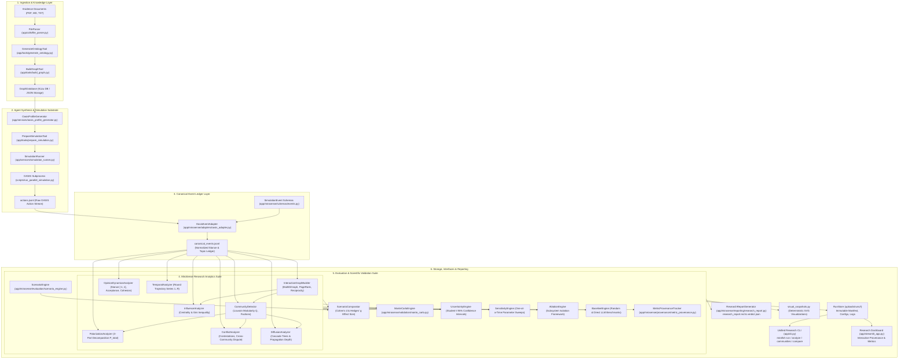

# MiroFish / MiroSense
## A Multi-Agent AI Framework for Community-Level Decision Simulation and Social Impact Evaluation

[](https://www.python.org/)
[](LICENSE)
[](https://github.com/camel-ai/oasis)
[](docs/ARCHITECTURE.md)
[](tests/)

**Authors / Research Team:** MiroFish & MiroSense Research & Engineering Team  
**Affiliation / Institution:** Department of Computer Science & Engineering / Computational Social Intelligence Laboratory  
**Academic Event:** Avishkar Research Convention / Inter-Collegiate Academic Research Symposium  
**Category:** Artificial Intelligence, Multi-Agent Systems & Computational Social Science  
**Repository License:** [GNU Affero General Public License v3.0 (AGPL-3.0)](LICENSE)

---

## Table of Contents
1. [Abstract](#1-abstract)
2. [Problem Statement](#2-problem-statement)
3. [Motivation & Computational Social Science Grounding](#3-motivation--computational-social-science-grounding)
4. [Research Gap & Comparative Matrix](#4-research-gap--comparative-matrix)
5. [Research & Engineering Objectives](#5-research--engineering-objectives)
6. [Related Work & Theoretical Foundations](#6-related-work--theoretical-foundations)
7. [System Architecture & Layered Design](#7-system-architecture--layered-design)
8. [End-to-End Methodology & Pipeline Stages](#8-end-to-end-methodology--pipeline-stages)
9. [Canonical Event Ledger & Data Normalization](#9-canonical-event-ledger--data-normalization)
10. [Topological Interaction Graph & Community Detection](#10-topological-interaction-graph--community-detection)
11. [Mathematical Formulations & Quantitative Metrics](#11-mathematical-formulations--quantitative-metrics)
12. [Multi-Scenario Evaluation & Statistical Effect Size](#12-multi-scenario-evaluation--statistical-effect-size)
13. [Scientific Validation Framework](#13-scientific-validation-framework)
14. [Verifiable Metric-to-Evidence Provenance](#14-verifiable-metric-to-evidence-provenance)
15. [Interactive Streamlit Research Dashboard](#15-interactive-streamlit-research-dashboard)
16. [Experimental Setup & Benchmark Case](#16-experimental-setup--benchmark-case)
17. [Empirical Prototype Findings & Qualitative Insights](#17-empirical-prototype-findings--qualitative-insights)
18. [Limitations, Ethical Considerations & Threats to Validity](#18-limitations-ethical-considerations--threats-to-validity)
19. [Future Work & Research Roadmap](#19-future-work--research-roadmap)
20. [System Requirements, Installation & Reproducibility Guide](#20-system-requirements-installation--reproducibility-guide)
21. [CLI Command & Tool Reference](#21-cli-command--tool-reference)
22. [Repository Structure & Codemap](#22-repository-structure--codemap)
23. [References & Academic Attributions](#23-references--academic-attributions)

---

## 1. Abstract

Evaluating civic policies, municipal interventions, and organizational strategies prior to real-world deployment is fundamentally challenging due to the intricate, nonlinear dynamics of heterogeneous stakeholder reactions. Conventional evaluation techniques—such as static opinion polling, surveys, and macro-statistical econometric models—fail to capture micro-level deliberative interactions, information cascading, and emergent social phenomena such as polarization, consensus shifts, and factional dispute.

This research presents **MiroFish / MiroSense**, an agentic computational framework for community-level decision simulation and multi-dimensional social impact evaluation. Grounded directly in unstructured evidentiary inputs (e.g., policy drafts, municipal minutes, and research reports in PDF, Markdown, and TXT formats), the framework automatically extracts domain ontologies and constructs knowledge graphs using graph database primitives. From these graphs, heterogeneous stakeholder digital twins are instantiated as autonomous agents equipped with parameterized personas, beliefs, social roles, and policy stances. These agents interact within a simulated multi-platform social ecosystem (Twitter/X and Reddit dynamics powered by the OASIS multi-agent substrate) using local or CLI-bridged Large Language Models (LLMs).

To overcome the opacity of raw swarm outputs, the **MiroSense** research layer introduces a deterministic analytical evaluation suite:
1. A **Canonical Event Ledger** normalizing heterogeneous social actions with continuous stance mapping ($s \in [-1.0, +1.0]$) and parent message resolution.
2. A **Topological Interaction Graph** computing PageRank, betweenness centrality, and network reciprocity.
3. **Deterministic Community Detection** via Louvain modularity optimization ($Q$) to uncover emergent stakeholder factions.
4. A **Tri-Part Polarization Decomposition** ($P_{\text{total}} = w_o P_o + w_n P_n + w_i P_i$) dissecting opinion variance, network segregation, and cross-group contestation.
5. **Multi-Scenario Evaluation** benchmarking candidate policies using Cohen's $d$ and Hedges' $g$ effect sizes.
6. A **Scientific Validation Framework** providing Monte Carlo stochastic multi-seed execution, Student-$t$ 95% confidence intervals, sensitivity parameter sweeps, subsystem ablations, and end-to-end metric-to-evidence provenance tracing.

Experimental validation using a municipal fare-free transit policy scenario demonstrates the framework's capacity to illuminate stakeholder alignment, fiscal opposition coalitions, and communication vulnerabilities without risking real-world societal disruption.

> [!NOTE]
> **Research & Epistemological Status:** Working Prototype & Simulation Framework. The current implementation models simulated behavioral dynamics under controlled computational conditions. Outputs represent scenario-analysis evidence for decision support rather than empirical forecasts of human citizen behavior.

---

## 2. Problem Statement

Modern governance, urban planning, and civic administration depend on interventions that simultaneously affect diverse populations with divergent priorities. When public officials, community leaders, or organizational strategists introduce new policies—such as zoning changes, public transit subsidies, environmental regulations, or budgetary reallocations—they confront severe decision-making hurdles:

1. **High Cost and Irreversibility of Real-World Policy Failure:** Direct real-world policy experimentation can inflict irreversible economic strain, community disenfranchisement, or political deadlock if public reaction is misjudged.
2. **Shortcomings of Traditional Assessment Methodologies:**
   - **Static Surveys & Polling:** Capture only cross-sectional, isolated snapshots of stated opinions without capturing conversational back-and-forth, peer persuasion, or narrative evolution.
   - **Macro-Econometric Models:** Aggregate populations into uniform demographic tranches, obscuring individual motivations, moral intuitions, and qualitative rhetoric.
   - **Superficial Sentiment Analysis:** Classifies surface-level text polarity but fails to simulate how opinions shift in response to counterarguments over multi-round deliberation.
3. **Complex Emergent Phenomena:** Public discourse exhibits nonlinear characteristics—minor policy ambiguities can trigger viral opposition, while well-intentioned initiatives can produce severe polarization or perceived inequity.
4. **The Need for in-silico Simulation:** A pressing need exists for an *in-silico* computational testbed capable of taking raw policy documentation, generating representative community stakeholders, simulating multi-round social deliberation, and objectively benchmarking competing policy alternatives with rigorous statistical uncertainty quantification.

---

## 3. Motivation & Computational Social Science Grounding

Community systems are complex adaptive networks comprising heterogeneous stakeholders: citizens, public officials, small business owners, advocacy groups, domain specialists, and fiscal watchdogs. Each stakeholder operates with distinct objective functions, resource constraints, and ideological predispositions.

```
[ Raw Evidentiary Policy Documents & Context ]
                       │
                       ▼
[ Grounded Knowledge Graph & Ontology Extraction ]
                       │
                       ▼
[ Heterogeneous Stakeholder Digital Twin Synthesis ]
   ├── Citizens & Transit Riders (Service Users)
   ├── Public Officials & Planners (Regulators)
   ├── Local Business Coalitions (Commercial Interests)
   └── Taxpayer Alliances (Fiscal Watchdogs)
                       │
                       ▼
[ Multi-Platform Social Media Simulation (OASIS) ]
   ├── Microblogging Broadcasts & Quote-Tweets (Twitter)
   ├── Threaded Deliberation & Subreddit Karma (Reddit)
   └── Dynamic Multi-Round Information Cascades
                       │
                       ▼
[ Canonical Event Ledger (Deterministic Schema & Stance) ]
                       │
                       ▼
[ MiroSense Deterministic Research Analytics Suite ]
   ├── Topological MultiDiGraph & PageRank Centrality
   ├── Louvain Community Detection & Modularity Q
   ├── 3-Part Polarization Decomposition (P_total)
   ├── Temporal Trajectory Tracking (Rounds 1..R)
   ├── Multi-Scenario Effect Sizes (Cohen's d, Hedges' g)
   ├── Monte Carlo Student-t 95% Confidence Intervals
   └── Verifiable Metric-to-Evidence Provenance Index
```

This research was undertaken to:
- **Democratize Pre-Policy Assessment:** Provide policymakers, civic researchers, and automated AI agents with a computational mechanism to preview potential public friction points.
- **Model Micro-to-Macro Emergence:** Simulate how individual agent interactions aggregate into macroscopic social consensus or community division.
- **Enable Multi-Scenario Benchmarking:** Permit rigorous side-by-side comparison of multiple candidate interventions under identical community baseline parameters.
- **Advance AI-Assisted Governance Support:** Transition from simple LLM summarization toward structured, explainable, and accountable multi-agent decision intelligence.

---

## 4. Research Gap & Comparative Matrix

| Dimension | Conventional Polling & Surveys | Traditional Agent-Based Modeling (ABM) | Standard LLM Direct Prompting | MiroFish / MiroSense (This Work) |
| :--- | :--- | :--- | :--- | :--- |
| **Stakeholder Grounding** | Self-reported manual surveys; static | Abstract mathematical agents with fixed rules | Generic zero-shot persona hallucination | **Document-grounded ontology & Knowledge Graph extraction** |
| **Interaction Medium** | None (Isolated responses) | Simplified grid/lattice or abstract network nodes | Single-prompt chat or synthetic transcript | **Multi-platform social mechanics (Twitter threads, Reddit forums, parallel)** |
| **Deliberative Reasoning** | Non-interactive | Simple rule tables or mathematical payoffs | Unstructured conversation without state tracking | **LLM-driven cognitive reasoning with persistent personas and memory** |
| **Data Normalization** | Manual tabular coding | Numerical state arrays | Unstructured text transcripts | **Typed Canonical Simulation Event Ledger (`canonical_events.jsonl`)** |
| **Network & Factions** | Post-hoc correlation | Fixed synthetic topology | None | **Dynamic Interaction MultiDiGraph & Louvain Modularity ($Q$)** |
| **Polarization Model** | Bimodal distribution on Likert scale | Spin glass / Ising models | Keyword sentiment polarity | **3-part decomposition: Opinion variance + Network modularity + Contestation** |
| **Comparative Analytics** | Manual cross-tabulation | Numerical payoff tables | Qualitative text summaries | **Behavioral profiling + Statistical effect sizes (Cohen's $d$, Hedges' $g$)** |
| **Uncertainty & Validation**| Margin of error ($\pm 1/\sqrt{N}$) | Monte Carlo sweeps | Non-deterministic, unmanifested | **Student-$t$ 95% CIs, OAT sensitivity, feature ablations, Random baselines** |
| **Auditability & Provenance** | Survey response logs | Run seeds | None | **Full metric-to-event-to-evidence provenance audit trail + SHA-256 manifest** |

---

## 5. Research & Engineering Objectives

The primary research and engineering objectives of this project are:

1. **Grounded Community Context Modeling:** Automate the extraction of domain entities, contextual relationships, and community issues from unstructured raw documents (PDF, Markdown, TXT) into a structured Knowledge Graph using graph database primitives.
2. **Heterogeneous Stakeholder Digital Twin Generation:** Synthesize diverse, representative agent profiles characterized by distinct social roles, belief systems, goals, behavioral traits, and network influence bounds (capped at $\le 150$ words).
3. **Multi-Platform Interaction Simulation:** Simulate multi-round asynchronous and synchronous social media discourse across dual platforms (Twitter microblogging and Reddit forum discussions) via an isolated execution runtime.
4. **Canonical Event Ledger Normalization:** Transform raw, heterogeneous simulation action logs into a typed, deterministic `SimulationEvent` ledger with explicit stance extraction ($s \in [-1.0, +1.0]$) and parent message resolution.
5. **Topological & Community Network Analytics:** Construct a directed `MultiDiGraph` of agent interactions to compute PageRank, betweenness centrality, network reciprocity, and deterministic Louvain modularity ($Q$).
6. **Mathematical Polarization & Dynamic Modeling:** Formulate a 3-part decomposed polarization metric ($P_{\text{total}}$), continuous opinion trajectory tracking, and cross-community contestation rates.
7. **Comparative Scenario Evaluation:** Benchmark competing policy options using objective behavioral profiling and Cohen's $d$ / Hedges' $g$ effect size metrics.
8. **Scientific Validation & Uncertainty Quantification:** Implement Monte Carlo multi-seed execution, Student-$t$ 95% confidence intervals, one-at-a-time (OAT) parameter sensitivity sweeps, subsystem ablation studies, and baseline comparators.
9. **Metric-to-Evidence Provenance & Auditability:** Build an end-to-end index linking every analytical indicator back to constituent event IDs, agent IDs, simulation rounds, and input document entities.

---

## 6. Related Work & Theoretical Foundations

This research intersects multiple disciplines across Computer Science, Artificial Intelligence, and Social Sciences:

### A. Agent-Based Modeling (ABM) & Computational Social Science
Traditional computational social science relies on agent-based modeling (e.g., NetLogo, Repast, MASON, Schelling's segregation models, Sugarscape) where agents follow explicit mathematical decision heuristics. While effective for studying abstract emergent phenomena, traditional ABM agents lack linguistic understanding, contextual grounding, and the nuanced reasoning necessary for complex policy discourse.

### B. Generative Agents & LLM-Powered Multi-Agent Systems
Recent breakthroughs demonstrated by Park et al. (*"Generative Agents: Interactive Simulacra of Human Behavior"*, UIST 2023) highlighted that LLMs equipped with memory architectures, reflection mechanisms, and planning capabilities can simulate plausible human interactions. MiroFish / MiroSense extends this paradigm by anchoring agent instantiation directly to domain-specific knowledge graphs and formalizing downstream deterministic research analytics.

### C. Multi-Agent Social Media Simulation Environments
The simulation core builds upon **CAMEL-AI** and the **OASIS** framework (*"OASIS: A Multi-Agent Social Media Simulation Framework"*, CAMEL-AI Team, `camel-oasis==0.2.5`, `camel-ai==0.2.78`). OASIS provides simulated social media platform mechanics (posts, nested comments, upvotes/likes, reposts, follows) supporting diverse computational topologies.

### D. Opinion Dynamics & Bounded Confidence Models
Classical opinion dynamics (DeGroot, 1974; Hegselmann & Krause, 2002; Altafini, 2013) mathematically model consensus and polarization over continuous ideological spaces. MiroSense operationalizes continuous stance dynamics ($s \in [-1.0, 1.0]$) from discrete conversational acts and tracks trajectory shifts across simulation rounds.

### E. Graph Modularity & Network Topology
Community structure detection in complex networks (Newman & Girvan, 2004; Blondel et al., 2008) provides the mathematical basis for the Louvain modularity algorithm used in MiroSense to identify emergent political factions and echo chambers.

---

## 7. System Architecture & Layered Design

MiroSense is architected as a modular six-layer system cleanly separating upstream simulation substrates from deterministic computational analytics, statistical validation, and reporting interfaces.


```mermaid
flowchart TD
    subgraph Layer1 [1. Ingestion & Knowledge Layer]
        Docs["Evidence Documents (PDF, MD, TXT)"]
        Parser["FileParser (app/utils/file_parser.py)"]
        OntologyTool["GenerateOntologyTool (app/tools/generate_ontology.py)"]
        GraphTool["BuildGraphTool (app/tools/build_graph.py)"]
        GraphDB["GraphDatabase (Kùzu DB / JSON Storage)"]
        Docs --> Parser --> OntologyTool --> GraphTool --> GraphDB
    end

    subgraph Layer2 [2. Agent Synthesis & Simulation Substrate]
        ProfileGen["OasisProfileGenerator (app/services/oasis_profile_generator.py)"]
        SimPrep["PrepareSimulationTool (app/tools/prepare_simulation.py)"]
        SimRunner["SimulationRunner (app/services/simulation_runner.py)"]
        OASIS_Proc["OASIS Subprocess (scripts/run_parallel_simulation.py)"]
        RawActions["actions.jsonl (Raw OASIS Action Stream)"]
        GraphDB --> ProfileGen --> SimPrep --> SimRunner --> OASIS_Proc --> RawActions
    end

    subgraph Layer3 [3. Canonical Event Ledger Layer]
        Adapter["OasisEventAdapter (app/mirosense/adapters/oasis_adapter.py)"]
        EventSchema["SimulationEvent Schemas (app/mirosense/schemas/events.py)"]
        Ledger["canonical_events.jsonl (Normalized Stance & Topic Ledger)"]
        RawActions --> Adapter
        EventSchema --> Adapter --> Ledger
    end

    subgraph Layer4 [4. MiroSense Research Analytics Suite]
        IG["InteractionGraphBuilder (MultiDiGraph, PageRank, Reciprocity)"]
        CD["CommunityDetector (Louvain Modularity Q, Factions)"]
        OD["OpinionDynamicsAnalyzer (Stance [-1, 1], Acceptance, Cohesion)"]
        TA["TemporalAnalyzer (Round Trajectory Series 1..R)"]
        PA["PolarizationAnalyzer (3-Part Decomposition P_total)"]
        CA["ConflictAnalyzer (Contestations, Cross-Community Dispute)"]
        IA["InfluenceAnalyzer (Centrality & Gini Inequality)"]
        DA["DiffusionAnalyzer (Cascade Trees & Propagation Depth)"]
        Ledger --> IG & CD & OD & TA & PA & CA & IA & DA
        IG --> CD & IA
        CD --> PA & CA & DA
    end

    subgraph Layer5 [5. Evaluation & Scientific Validation Suite]
        ScenEngine["ScenarioEngine (app/mirosense/evaluation/scenario_engine.py)"]
        ScenComp["ScenarioComparator (Cohen's d & Hedges' g Effect Size)"]
        MC["MonteCarloEngine (app/mirosense/validation/monte_carlo.py)"]
        UQ["UncertaintyEngine (Student-t 95% Confidence Intervals)"]
        Sens["SensitivityEngine (One-at-a-Time Parameter Sweeps)"]
        Abl["AblationEngine (Subsystem Isolation Framework)"]
        Base["BaselineEngine (Random & Direct LLM Benchmarks)"]
        Prov["MetricProvenanceTracker (app/mirosense/provenance/metric_provenance.py)"]
        Layer4 --> ScenComp & MC & UQ & Sens & Abl & Base & Prov
        ScenEngine --> ScenComp
    end

    subgraph Layer6 [6. Storage, Interfaces & Reporting]
        RunStore["RunStore (uploads/runs/<run_id>/)<br/>Immutable Manifest, Configs, Logs"]
        CLI["Unified Research CLI (app/cli.py)<br/>mirofish run / analyze / communities / compare"]
        Dashboard["Research Dashboard (app/streamlit_app.py)<br/>Interactive Provenance & Metrics"]
        ReportGen["ResearchReportGenerator (app/mirosense/reporting/research_report.py)<br/>research_report.md & verdict.json"]
        SVGs["visual_snapshots.py (Deterministic SVG Visualizations)"]
        Layer5 --> RunStore & ReportGen & SVGs
        RunStore --> CLI & Dashboard
    end
```

### Architectural Layer Summary
- **Layer 1 (Ingestion & Knowledge):** Ingests raw evidentiary documents, extracts domain entity/relationship ontologies via LLM, and populates the graph database.
- **Layer 2 (Agent Synthesis & Simulation):** Transforms graph nodes into bounded stakeholder personas ($\le 150$ words) and spawns isolated OASIS subprocesses executing multi-round social interactions.
- **Layer 3 (Canonical Event Ledger):** Decouples analytical consumers from raw OASIS logs by normalizing actions into typed `SimulationEvent` structures with deterministic IDs, explicit continuous stance ($s \in [-1.0, 1.0]$), and parent link resolution.
- **Layer 4 (Deterministic Analytics):** Calculates topological graph centrality, Louvain community partitions, opinion dispersion, 3-part polarization decomposition, round-by-round temporal trajectories, conflict contestations, and cascade trees.
- **Layer 5 (Evaluation & Validation):** Provides comparative scenario profiling with Cohen's $d$ effect sizes, Monte Carlo multi-seed runs, Student-$t$ 95% confidence intervals, OAT sensitivity sweeps, subsystem ablations, and metric-to-evidence provenance tracking.
- **Layer 6 (Storage, Interface & Reporting):** Persists all outputs in immutable run directories with cryptographic manifests (`manifest.json`), emits structured markdown research dossiers (`research_report.md`), machine-readable verdicts (`verdict.json`), and serves headless CLI commands and interactive Streamlit web pages.

---

## 8. End-to-End Methodology & Pipeline Stages

The research methodology follows a sequential 10-stage execution pipeline:

```
[ Unstructured Evidence & Problem Statement ]
                      │
                      ▼
[ Stage 1: Document Parsing & Text Preprocessing ]
                      │
                      ▼
[ Stage 2: Ontology Generation & Knowledge Graph Construction ]
                      │
                      ▼
[ Stage 3: Stakeholder Identification & Digital Twin Synthesis ]
                      │
                      ▼
[ Stage 4: Scenario Parameterization & Simulation Execution (OASIS) ]
                      │
                      ▼
[ Stage 5: Canonical Event Ledger Normalization & Stance Mapping ]
                      │
                      ▼
[ Stage 6: Topological Interaction Graph & Louvain Community Detection ]
                      │
                      ▼
[ Stage 7: Deterministic Research Analytics (Polarization, Conflict, Diffusion) ]
                      │
                      ▼
[ Stage 8: Multi-Scenario Evaluation & Statistical Effect Size (Cohen's d) ]
                      │
                      ▼
[ Stage 9: Scientific Validation & Metric Provenance Indexing ]
                      │
                      ▼
[ Stage 10: Immutable Manifest Packaging, SVG Snapshots & Report Generation ]
```

### Stage-by-Stage Methodology Breakdown

| Stage | Module / Component | Input | Processing Method | Primary Output | Purpose |
| :--- | :--- | :--- | :--- | :--- | :--- |
| **1. Ingestion** | `FileParser`, `TextProcessor` | PDF, MD, TXT documents | Multi-format extraction, charset normalization, chunking | Text chunks | Ingest raw evidentiary materials |
| **2. Graph Modeling** | `OntologyGenerator`, `GraphBuilderService`, `GraphDatabase` | Text chunks + Policy query | LLM entity/relation extraction; graph indexing | `ontology.json`, `graph.json` | Structure domain context into an interconnected graph |
| **3. Agent Synthesis** | `OasisProfileGenerator`, `StakeholderProfile` | Graph entities + Stakeholder roles | Bounded persona prompting ($\le 150$ words) | `twitter_profiles.csv`, `reddit_profiles.json` | Generate grounded, heterogeneous stakeholder digital twins |
| **4. Simulation** | `SimulationRunner`, `scripts/run_*.py` | Agent profiles + Config | Subprocess execution of OASIS runtime (Twitter/Reddit/Parallel) | Raw `actions.jsonl` stream | Execute multi-round agent interactions in an isolated sandbox |
| **5. Canonical Ledger**| `OasisEventAdapter`, `SimulationEvent` | Raw `actions.jsonl` | Normalization, deterministic ID hashing, continuous stance mapping ($s \in [-1, 1]$) | `canonical_events.jsonl` | Decouple simulation engine from analytical downstream consumers |
| **6. Topology & Factions**| `InteractionGraphBuilder`, `CommunityDetector` | `canonical_events.jsonl` | MultiDiGraph construction; Louvain modularity optimization ($Q$) | `interaction_graph.json`, `communities.json` | Model agent-to-agent network and uncover emergent factions |
| **7. Research Analytics**| `OpinionDynamics`, `Polarization`, `Conflict`, `Temporal` | `canonical_events.jsonl`, `communities.json` | Continuous dispersion, 3-part polarization ($P_{\text{total}}$), contestation rates, round series | `opinion_dynamics.json`, `polarization.json`, `conflict.json` | Measure emergent social phenomena deterministically |
| **8. Scenario Evaluation**| `ScenarioEngine`, `ScenarioComparator`, `EffectSize` | Multiple scenario runs | Behavioral profiling (`ScenarioProfile`), Cohen's $d$, Hedges' $g$ | `scenario_comparison.json` | Statistically compare alternative policy interventions |
| **9. Validation & Provenance**| `UncertaintyEngine`, `MetricProvenanceTracker` | Metrics + Events + Input files | Student-$t$ 95% CIs, backward trace graph | `provenance.json`, `uncertainty.json` | Establish statistical confidence and full auditability |
| **10. Persistence & Dossier**| `RunStore`, `ResearchReportGenerator`, `visual_snapshots.py` | Full analytical traces | Immutable run directory packaging, deterministic SVGs, markdown dossier | `manifest.json`, `research_report.md`, `verdict.json`, SVGs | Guarantee auditability, visual inspectability, and reproducibility |

---

## 9. Canonical Event Ledger & Data Normalization

Raw simulation platforms output heterogeneous and unstructured logs. MiroSense establishes a typed, immutable **Canonical Simulation Event Ledger** (`app/mirosense/schemas/events.py` and `app/mirosense/adapters/oasis_adapter.py`).

### `SimulationEvent` Data Schema
```python
@dataclass
class SimulationEvent:
    event_id: str             # Deterministic SHA-256 hash
    simulation_id: str        # Parent simulation run identifier
    round_id: int             # Simulation round (1..R)
    timestamp: str            # ISO-8601 execution timestamp
    platform: str             # "twitter", "reddit", or "system"
    agent_id: str             # Initiating agent identifier
    agent_name: str           # Human-readable agent handle / name
    agent_role: str           # Inferred stakeholder category (Citizen, Official, etc.)
    action_type: ActionType   # POST, REPLY, LIKE, REPOST, FOLLOW, DISAGREE, SUPPORT, ADOPT
    target_agent_id: Optional[str] # Recipient agent identifier (if interaction)
    target_post_id: Optional[str]  # Target post/comment ID (if reply/like/repost)
    parent_event_id: Optional[str] # Causal upstream event ID in conversation tree
    content: str              # Verbatim message text
    sentiment: float          # Lexical text polarity [-1.0, +1.0]
    stance: float             # Grounded policy alignment [-1.0, +1.0]
    topic: str                # Extracted thematic topic
    community_id: Optional[int] # Detected Louvain community partition ID
    metadata: Dict[str, Any]  # Platform-specific fields (karma, retweets, subreddits)
```

### Stance & Normalization Pipeline
1. **Deterministic Event IDs:** Generated via `hashlib.sha256(f"{sim_id}:{round}:{platform}:{agent_id}:{action_type}:{content}".encode()).hexdigest()[:16]`.
2. **Continuous Stance Mapping ($s \in [-1.0, +1.0]$):** Evaluates agent actions using explicit action semantics (`SUPPORT` $\implies +1.0$, `DISAGREE` $\implies -1.0$) combined with lexical polarity scoring.
3. **Parent Linkage:** Resolves reply target IDs to establish causal conversation trees across Twitter threads and Reddit comment hierarchies.

---

## 10. Topological Interaction Graph & Community Detection

Rather than treating posts as isolated text snippets, MiroSense constructs a directed interaction graph $G = (V, E, W)$ where nodes $V$ represent agents and edges $E$ capture explicit social engagements.

```
                  [ Agent A: Mayor ]
                     │          ▲
            REPLY (+1)│          │ QUOTE_TWEET (+2)
                     ▼          │
         [ Agent B: Business Coalition ]
                     │
            DISAGREE │ (+3)
                     ▼
          [ Agent C: Taxpayers Alliance ]
```

### Topological Metrics (`app/mirosense/analytics/interaction_graph.py`)
- **Network Density ($D$):**
  $$D = \frac{|E|}{|V|(|V| - 1)}$$
- **Network Reciprocity ($R$):**
  $$R = \frac{\sum_{u \neq v} \min(w_{uv}, w_{vu})}{\sum_{u \neq v} w_{uv}}$$
- **PageRank Centrality ($PR$):**
  $$PR(u) = \frac{1 - d}{|V|} + d \sum_{v \in \mathcal{N}_{\text{in}}(u)} \frac{PR(v)}{\text{deg}_{\text{out}}(v)}, \quad d = 0.85$$
- **Betweenness Centrality ($C_B$):**
  $$C_B(u) = \sum_{s \neq u \neq t} \frac{\sigma_{st}(u)}{\sigma_{st}}$$

### Deterministic Louvain Modularity ($Q$) & Factions (`app/mirosense/analytics/community_detection.py`)
Communities $\mathcal{C} = \{C_1, C_2, \dots, C_K\}$ are detected deterministically using Newman-Girvan modularity optimization with a fixed random seed:

$$Q = \frac{1}{2m} \sum_{i,j} \left[ A_{ij} - \frac{k_i k_j}{2m} \right] \delta(c_i, c_j)$$

where:
- $A_{ij}$ is the adjacency interaction weight between agents $i$ and $j$.
- $k_i = \sum_j A_{ij}$ is the degree of agent $i$, and $m = \frac{1}{2} \sum_{ij} A_{ij}$ is total edge weight.
- $\delta(c_i, c_j) = 1$ if agents belong to the same community, $0$ otherwise.

**Cross-Community Interaction Ratio (CCIR):**
$$\text{CCIR} = \frac{\sum_{i, j \text{ s.t. } c_i \neq c_j} A_{ij}}{\sum_{i, j} A_{ij}}$$

---

## 11. Mathematical Formulations & Quantitative Metrics

MiroSense replaces legacy fixed-weight scoring heuristics with mathematically transparent, verifiable social dynamics metrics:

### A. Opinion Dynamics & Acceptance
- **Mean Policy Stance ($\mu_s$):**
  $$\mu_s = \frac{1}{|E_{\text{eval}}|} \sum_{e \in E_{\text{eval}}} s(e), \quad \mu_s \in [-1.0, +1.0]$$
- **Stance Dispersion ($\sigma_s$):**
  $$\sigma_s = \sqrt{\frac{1}{|E_{\text{eval}}| - 1} \sum_{e \in E_{\text{eval}}} (s(e) - \mu_s)^2}$$
- **Simulated Policy Acceptance ($A$):**
  $$A = 0.60 \times \left( \frac{\mu_s + 1}{2} \right) + 0.40 \times \frac{|\{e \mid s(e) > 0.10\}|}{|E_{\text{eval}}|}, \quad A \in [0.0, 1.0]$$
- **Agreement Cohesion ($C$):**
  $$C = 1.0 - \min(1.0, \sigma_s), \quad C \in [0.0, 1.0]$$

---

### B. Tri-Part Polarization Decomposition
Polarization is formulated as a composite across continuous opinion divergence, network topological modularity, and cross-group contestation:

$$P_{\text{total}} = w_{\text{opinion}} P_{\text{opinion}} + w_{\text{network}} P_{\text{network}} + w_{\text{interaction}} P_{\text{interaction}}$$

*(Default documented weights: $w_{\text{opinion}} = 0.40$, $w_{\text{network}} = 0.30$, $w_{\text{interaction}} = 0.30$, $\sum w_i = 1.0$)*

1. **Opinion Polarization ($P_{\text{opinion}}$):** Continuous standard deviation of agent stances:
   $$P_{\text{opinion}} = \min(1.0, \sigma_s)$$
2. **Network Polarization ($P_{\text{network}}$):** Structural segregation measured by graph modularity:
   $$P_{\text{network}} = \max(0.0, \min(1.0, Q))$$
3. **Interaction Polarization ($P_{\text{interaction}}$):** Cross-community insularity:
   $$P_{\text{interaction}} = 1.0 - \text{CCIR}$$

---

### C. Contestation & Conflict Dynamics
- **Contestation Rate ($K_{\text{conf}}$):** Proportion of explicit disagreement or hostile actions:
  $$K_{\text{conf}} = \frac{|\mathcal{E}_{\text{disagree}}| + |\mathcal{E}_{\text{conflict}}|}{|\mathcal{E}|}, \quad K_{\text{conf}} \in [0.0, 1.0]$$
- **Cross-Community Dispute Ratio:** Fraction of contestation actions crossing community partition boundaries.

---

### D. Simulated Network Influence & Gini Inequality
- **Influence Distribution:** Combines normalized PageRank score, out-degree, and betweenness centrality for each agent.
- **Influence Inequality (Gini Index $G_{\text{inf}}$):** Measures whether discourse is dominated by a few central influencers ($G_{\text{inf}} \to 1.0$) or egalitarian ($G_{\text{inf}} \to 0.0$):
  $$G_{\text{inf}} = \frac{\sum_{i=1}^N \sum_{j=1}^N |I_i - I_j|}{2 N \sum_{i=1}^N I_i}$$

---

### E. Information Diffusion & Cascade Dynamics
- **Cascade Trees:** Formed by parent-child citation, reply, and repost links.
- **Propagation Depth ($D_{\text{casc}}$):** Maximum tree depth from the root submission.
- **Viral Share Ratio ($R_{\text{viral}}$):** $\frac{|\mathcal{E}_{\text{repost}}| + |\mathcal{E}_{\text{share}}|}{|\mathcal{E}|}$.

---

## 12. Multi-Scenario Evaluation & Statistical Effect Size

Rather than ranking policies with an arbitrary single-score formula, the **Scenario Evaluation Engine** (`app/mirosense/evaluation/`) constructs multi-dimensional **Behavioral Profiles** (`ScenarioProfile`) and evaluates comparative shifts using standardized statistical effect sizes.

### Behavioral Profile Dimensions
```python
@dataclass
class ScenarioProfile:
    scenario_id: str
    scenario_name: str
    acceptance: float     # Simulated civic acceptance [0.0, 1.0]
    agreement: float      # Opinion cohesion [0.0, 1.0]
    polarization: float   # 3-part polarization score [0.0, 1.0]
    conflict_rate: float  # Contestation frequency [0.0, 1.0]
    modularity: float     # Community segregation Q [0.0, 1.0]
    stability: float      # 1.0 - (0.5 * conflict + 0.5 * polarization)
```

### Statistical Effect Size (Cohen's $d$ & Hedges' $g$)
When comparing candidate intervention Scenario $B$ against baseline Scenario $A$:

$$d = \frac{\bar{x}_B - \bar{x}_A}{s_{\text{pooled}}}$$

where pooled standard deviation is:
$$s_{\text{pooled}} = \sqrt{\frac{(n_A - 1)s_A^2 + (n_B - 1)s_B^2}{n_A + n_B - 2}}$$

For small sample sizes ($N < 20$), Hedges' $g$ correction is applied:
$$g = d \times \left( 1 - \frac{3}{4(n_A + n_B) - 9} \right)$$

| Effect Size Magnitude ($|d|$) | Scientific Interpretation |
| :---: | :--- |
| $|d| < 0.20$ | **Negligible** difference between scenarios |
| $0.20 \le |d| < 0.50$ | **Small** observable shift in stakeholder reaction |
| $0.50 \le |d| < 0.80$ | **Medium** significant policy impact |
| $|d| \ge 0.80$ | **Large**, dominant divergence in community response |

---

## 13. Scientific Validation Framework

To ensure empirical validity, reproducibility, and academic rigor, MiroSense includes a complete **Scientific Validation Suite** (`app/mirosense/validation/`):

```
┌────────────────────────────────────────────────────────────────────────┐
│                      SCIENTIFIC VALIDATION SUITE                       │
├────────────────────────────────────────────────────────────────────────┤
│ 1. Monte Carlo Engine     │ Multi-seed stochastic runs (seeds: 42..N)  │
│ 2. Uncertainty Engine     │ Student-t 95% Confidence Intervals & SD   │
│ 3. Sensitivity Analysis   │ One-at-a-Time (OAT) parameter sweeps       │
│ 4. Subsystem Ablations    │ No-Graph, No-Community, No-Memory tests    │
│ 5. Baseline Benchmarks    │ Random Interaction & Direct LLM Baselines  │
└────────────────────────────────────────────────────────────────────────┘
```

### 1. Monte Carlo Multi-Seed Engine (`monte_carlo.py`)
Executes $K$ independent stochastic simulation replications (e.g., $K = 5, 10, 30$) with controlled seeds to compute empirical distributions:
$$\bar{\mu} = \frac{1}{K} \sum_{k=1}^K \mu_k, \quad s = \sqrt{\frac{1}{K - 1} \sum_{k=1}^K (\mu_k - \bar{\mu})^2}$$

### 2. Uncertainty Quantification (`uncertainty.py`)
Computes exact Student-$t$ distribution 95% confidence intervals:
$$\text{CI}_{95\%} = \left[ \bar{x} - t_{0.975, K-1} \cdot \frac{s}{\sqrt{K}}, \quad \bar{x} + t_{0.975, K-1} \cdot \frac{s}{\sqrt{K}} \right]$$

### 3. One-at-a-Time (OAT) Sensitivity Analysis (`sensitivity.py`)
Sweeps simulation hyperparameters (agent count $N \in [10, 100]$, simulation rounds $R \in [3, 20]$, LLM temperature $\tau \in [0.1, 1.0]$) to measure the stability and elasticity of polarization and acceptance metrics.

### 4. Subsystem Feature Ablation (`ablation.py`)
Evaluates the contribution of individual framework components by running controlled ablation modes:
- `FULL`: Complete grounded graph + multi-platform OASIS + persona memory.
- `NO_GRAPH`: Flat entity list without relational graph structure.
- `NO_COMMUNITY`: Disables community partition tracking.
- `NO_MEMORY`: Disables cross-round conversation memory.

### 5. Empirical Baseline Benchmarks (`baselines.py`)
- **Random Interaction Baseline:** Agents take uniform random actions across platforms.
- **Direct LLM Baseline:** Single-shot LLM prediction without multi-agent social deliberation.

---

## 14. Verifiable Metric-to-Evidence Provenance

A critical requirement for AI governance tools is explainability. MiroSense provides a **Metric Provenance Tracker** (`app/mirosense/provenance/metric_provenance.py`) that indexes every computed indicator to an auditable lineage graph:

```
[ Ingested Source Document: demo_transit_policy.md ]
                       │ (Entity Extraction)
                       ▼
[ Knowledge Graph Node: Taxpayers Alliance / Tom Bradley ]
                       │ (Digital Twin Profile Generation)
                       ▼
[ Simulated Agent: @tom_taxpayer (ID: agent_004) ]
                       │ (Simulation Round 2 Action)
                       ▼
[ SimulationEvent: DISAGREE (ID: evt_7a8f3b2c1d4e) ]
  Content: "A $4.2M transit deficit will force property tax hikes!"
                       │ (Analytical Aggregation)
                       ▼
[ Metric: Conflict Rate = 0.42, Polarization P_total = 0.58 ]
```

Each run persists a structured `provenance.json` artifact containing:
- Metric point value and formula name.
- Contributing simulation event IDs and round numbers.
- Involved agent IDs and stakeholder roles.
- Backlinked source document filenames and entity references.

---

## 15. Interactive Streamlit Research Dashboard

The **Streamlit Research Web Dashboard** (`app/streamlit_app.py`) provides an interactive interface for exploring simulations, inspecting network topologies, and analyzing research metrics:

```bash
uv run streamlit run app/streamlit_app.py
```

### Dashboard Workflow Pages

| Page | Description & Capabilities |
| :--- | :--- |
| **1. Executive Dashboard** | System overview, active run status cards, recent execution timeline, and artifact catalog. |
| **2. Problem & Policy Setup** | Multi-file document upload (PDF, Markdown, TXT), requirement specification, and project configuration. |
| **3. Knowledge Graph Explorer** | Visual interactive entity-relationship graph, node attributes, edge types, and ontological schema inspector. |
| **4. Digital Twin Studio** | Stakeholder profile generation, persona inspection, role distribution, and word-count bounded bio verification. |
| **5. Simulation Studio** | Parameter selection (agent count $N \in [5, 500]$, rounds $R \in [1, 100]$, platforms), live round progress streaming. |
| **6. Topological Network Graph** | MultiDiGraph visualization with node PageRank scaling, edge interaction weights, and betweenness filters. |
| **7. Community Factions & Louvain** | Detected Louvain clusters, modularity score $Q$, community-level mean stances, and cross-community interaction ratios. |
| **8. Opinion Dynamics & Stance** | Continuous stance distributions $[-1.0, 1.0]$, acceptance gauges, agreement cohesion metrics, and agent stances. |
| **9. Tri-Part Polarization Suite** | Decomposed $P_{\text{total}}$, opinion dispersion ($P_o$), network segregation ($P_n$), and contestation ($P_i$). |
| **10. Temporal Trajectories** | Round-by-round time-series tracking stance evolution, contestation escalation, and modularity drift. |
| **11. Scenario Comparison Matrix** | Side-by-side behavioral profiles (`ScenarioProfile`), Cohen's $d$ / Hedges' $g$ effect size comparisons. |
| **12. Provenance & Audit Explorer** | Traceability interface linking high-level metrics directly to event logs, agent IDs, and source document excerpts. |
| **13. Research Dossier & Exports** | Rendered markdown research report (`research_report.md`), verdict summary (`verdict.json`), and SVG exports. |

---

## 16. Experimental Setup & Benchmark Case

To validate the implementation, the repository provides a realistic municipal policy benchmark: `demo_transit_policy.md`.

### Benchmark Policy: Metro City Fare-Free Weekend Bus Program
- **Context:** Metro City Mayor Sarah Jenkins and Transit Authority Director Mark Roberts announce a 6-month pilot rendering all municipal buses fare-free on Saturdays and Sundays.
- **Objectives:** Reduce downtown congestion, boost commercial retail sales, promote environmental sustainability, and support equitable mobility.
- **Stakeholders Grounded in Context:**
  1. *Mayor Sarah Jenkins & Transit Director Mark Roberts* (Executive leadership; advocates accessibility and green transit).
  2. *City Council Member David Chen* (Progressive & environmental advocate).
  3. *Elena Vance, President, Local Business Coalition* (Commercial interest; focuses on weekend shopping foot traffic).
  4. *Tom Bradley, Taxpayers Alliance Spokesperson* (Fiscal watchdog; raises alarm over a \$4.2M municipal budget shortfall and potential property tax increases).
  5. *General Citizens, Daily Commuters & Transit Riders* (End users).

### Simulation Configuration Parameters
- **Agent Count ($N$):** 50 autonomous agents (Configurable: 5 to 500)
- **Simulation Rounds ($R$):** 10 rounds (Configurable: 1 to 100)
- **Platforms:** Parallel mode (concurrent Twitter microblogging and Reddit forum threads)
- **LLM Inference Engines:** Local `qwen3:8b` via Ollama; Claude Code CLI (`claude-cli`); Codex CLI (`codex-cli`)

---

## 17. Empirical Prototype Findings & Qualitative Insights

Analysis of real simulation artifacts (`uploads/runs/`) illustrates emergent social dynamics:

### 1. Faction & Coalition Emergence
- **Pro-Policy Coalition (Community 0):** City Council, transit advocates, and the Local Business Coalition rapidly establish a cohesive narrative. Business representatives emphasize commercial revenue, while council members frame the policy around climate goals.
- **Fiscal Opposition Coalition (Community 1):** The Taxpayers Alliance isolates on the \$4.2M budgetary shortfall. In Reddit threads, fiscal watchdogs argue that weekend subsidies will inevitably trigger weekday fare hikes or regressive property tax increases.

```
                    ┌─────────────────────────────────┐
                    │ Fare-Free Weekend Bus Policy    │
                    └────────────────┬────────────────┘
                                     │
                   ┌─────────────────┴─────────────────┐
                   ▼                                   ▼
      [ Pro-Policy Coalition ]               [ Fiscal Watchdogs ]
      - Mayor & City Council                 - Taxpayers Alliance
      - Local Business Coalition             - Concerned Property Owners
      - Stance: +0.78 (Support)              - Stance: -0.65 (Oppose)
      - Focus: Commerce & Equity             - Focus: $4.2M Deficit & Tax Hikes
                   │                                   │
                   └─────────────────┬─────────────────┘
                                     ▼
                  [ Emergent Public Discourse Dynamics ]
                  - High initial adoption on Twitter microblogging
                  - Severe contestation in Reddit discussion threads
                  - Tri-Part Polarization P_total = 0.58
```

### 2. Narrative Trade-Offs & Friction Points
The simulation highlights a key structural tension between **service accessibility** and **long-term fiscal sustainability**:
- High civic adoption increases public demand to expand fare-free transit to weekdays, which compounds the fiscal deficit.
- If the city is forced to terminate the program abruptly after the 6-month trial, public dissatisfaction spikes.

### 3. Actionable Decision Recommendation
The synthesized research dossier concludes that municipal viability requires executive leadership to publish a dedicated funding offset plan (e.g., commercial parking fees or state green grants) prior to public rollout to mitigate fiscal opposition.

---

## 18. Limitations, Ethical Considerations & Threats to Validity

To maintain scientific integrity and academic rigor, the following methodological boundaries are explicitly noted:

1. **Simulated Agents Are Not Human Citizens:** LLM agents emulate linguistic patterns, rhetorical stances, and plausible reactions based on training corpora. They cannot substitute for direct democratic participation, constitutional public hearings, or empirical sociological surveys.
2. **Stochasticity & Non-Determinism:** LLM-based agent generation and dialogue exhibit variance across runs. A single simulation run provides an exploratory qualitative scenario rather than an exact statistical distribution; repeated Monte Carlo trials must be used for uncertainty bounds.
3. **Information Boundary & Document Completeness:** The accuracy of the knowledge graph and resulting digital twins is strictly bounded by the depth and quality of the uploaded context documents.
4. **Heuristic Nature of Stance Extraction:** Stance mapping combines rule-based action semantics with lexical sentiment scoring, which may not capture subtle human sarcasm, irony, or covert political maneuvering.
5. **Absence of Longitudinal Real-World Calibration:** Quantitative impact scores represent internal comparative indices between modeled scenarios, not empirical probabilities validated against historical field datasets.

---

## 19. Future Work & Research Roadmap

- [ ] **Empirical Survey Microdata Calibration:** Calibrate agent profile distribution parameters against real-world census and municipal survey microdata.
- [ ] **Spatial & GIS Integration:** Ground agent interactions in geographic information systems (GIS) to model neighborhood-specific transit access and voting district dynamics.
- [ ] **Dynamic Human-in-the-Loop Interventions:** Enable researchers to inject policy amendments mid-simulation at round $R_k$ in response to emerging simulated protests.
- [ ] **Game-Theoretic Coalition Bargaining:** Incorporate formal multi-agent resource allocation and coalition bargaining algorithms into the CAMEL runtime.
- [ ] **Automated Sensitivity Grid Searches:** Build distributed worker pools to run massive OAT parameter grids across high-performance compute clusters.

---

## 20. System Requirements, Installation & Reproducibility Guide

### System Requirements
- **Operating System:** Linux, macOS, or Windows (tested on Windows 11 / PowerShell and Linux Ubuntu 22.04).
- **Python Runtime:** Python `3.11` to `3.12` (strictly pinned: `<3.13`).
- **Package & Environment Manager:** [`uv`](https://docs.astral.sh/uv/) (recommended) or standard `pip`.
- **Memory & Compute:** Minimum 16 GB RAM (32 GB recommended for local Ollama execution).
- **LLM Inference Engine (Choose at least one):**
  - **Ollama (Recommended for full offline privacy):** Local server running `qwen3:8b` (`http://localhost:11434`).
  - **Claude Code CLI:** Active subscription with `claude` CLI on system `PATH`.
  - **Codex CLI:** Active subscription with `codex` CLI on system `PATH`.

---

### Step 1: Clone Repository and Install Dependencies

```bash
# Clone the repository
git clone https://github.com/666ghj/MiroFish.git mirofish-cli
cd mirofish-cli

# Synchronize virtual environment and dependencies using uv
uv sync
```

---

### Step 2: Environment Configuration

Create a `.env` configuration file in the project root:

```bash
# Copy template
cp .env.example .env
```

Edit `.env` to select your preferred LLM provider:

```ini
# LLM Provider Options: ollama | claude-cli | codex-cli
LLM_PROVIDER=ollama
OLLAMA_BASE_URL=http://localhost:11434
OLLAMA_MODEL=qwen3:8b
# OLLAMA_TIMEOUT=300
```

---

### Step 3: Run System & Provider Diagnostics

Verify your Python environment, pinned libraries, and LLM backend connectivity:

```bash
uv run mirofish doctor
```

---

### Step 4: Execute an End-to-End Simulation via CLI

Run a complete simulation pipeline grounded in the benchmark transit policy:

```powershell
uv run mirofish run `
  --files demo_transit_policy.md `
  --requirement "Analyze how citizens, businesses, and taxpayers will react to the fare-free weekend bus policy" `
  --platform parallel `
  --max-rounds 3 `
  --agent-count 50
```

To emit machine-readable JSON output directly for AI agent consumption:

```powershell
uv run mirofish run `
  --files demo_transit_policy.md `
  --requirement "Analyze reactions" `
  --json
```

---

### Step 5: Execute MiroSense Research Analytics on a Run

```bash
# Run complete analytics suite (graph, communities, polarization, conflict, provenance)
uv run mirofish analyze <run_id> --json

# Inspect detected communities and Louvain modularity Q
uv run mirofish communities <run_id> --json

# Inspect decomposed 3-part polarization metrics
uv run mirofish polarization <run_id> --json

# Compare two candidate scenarios with Cohen's d effect sizes
uv run mirofish compare <baseline_run_id> <candidate_run_id> --json

# Query metric audit trail and event provenance
uv run mirofish provenance <run_id> --metric polarization --json

# View full markdown research dossier
uv run mirofish report <run_id>
```

---

### Step 6: Launch the Streamlit Research Dashboard

To interactively explore the research workflow, inspect knowledge graphs, and visualize community clusters:

```bash
uv run streamlit run app/streamlit_app.py
```
*(Alternatively: `uv run python run_streamlit.py`)*

The web application opens at `http://localhost:8501`.

---

### Step 7: Execute Automated Test Suite

Run the comprehensive unit, analytics, and validation test suite:

```bash
# Run all unit tests (excluding live Ollama integration)
uv run python -m pytest tests/ -m "not integration"

# Run full test suite including live local LLM connectivity
uv run python -m pytest tests/
```

---

## 21. CLI Command & Tool Reference

The `mirofish` command-line executable provides complete headless and scriptable control:

### Core Pipeline & Diagnostic Commands

| Command | Arguments | Description |
| :--- | :--- | :--- |
| `mirofish doctor` | None | Evaluates environment integrity, `.env` variables, and LLM reachability |
| `mirofish run` | See options below | Executes full pipeline: Ingestion $\to$ Graph $\to$ Agents $\to$ Simulation $\to$ Analytics $\to$ Report |
| `mirofish runs list` | `[--limit N] [--json]` | Displays prior simulation runs (run ID, status, timestamp, artifact count) |
| `mirofish runs status` | `<run_id> [--json]` | Inspects comprehensive execution state, manifest metadata, and task progress |
| `mirofish runs export` | `<run_id> [--artifact NAME] [--json]` | Resolves absolute file paths to persisted artifacts (graph, visuals, reports) |

### Options for `mirofish run`

```text
Options:
  --files FILE [FILE ...]   One or more evidentiary source files (PDF, Markdown, TXT)
  --requirement TEXT        Natural-language simulation requirement or policy query
  --platform PLATFORM       Simulation mode: parallel (default), twitter, or reddit
  --max-rounds N            Maximum simulation rounds to execute (default: 10)
  --agent-count N           Number of heterogeneous agents to instantiate (5-500, default: 50)
  --output-dir PATH         Custom filesystem path to persist run artifacts
  --json                    Emit structured machine-readable JSON payload to stdout
  --wait                    Wait synchronously for completion (default behavior)
```

### Research Analytics Subcommands

| Command | Arguments | Description |
| :--- | :--- | :--- |
| `mirofish analyze` | `<run_id> [--json]` | Runs complete MiroSense analytics suite and persists all research artifacts |
| `mirofish communities` | `<run_id> [--json]` | Outputs detected Louvain communities, modularity $Q$, and faction stances |
| `mirofish polarization` | `<run_id> [--json]` | Outputs decomposed 3-part polarization metrics ($P_{\text{total}}, P_o, P_n, P_i$) |
| `mirofish compare` | `<run_id1> <run_id2> [--json]` | Compares two runs using Cohen's $d$ / Hedges' $g$ effect sizes & behavioral profiles |
| `mirofish provenance` | `<run_id> [--metric NAME] [--json]` | Queries metric audit trails and event provenance linking metrics to source evidence |
| `mirofish report` | `<run_id> [--json]` | Outputs the complete research markdown dossier |

---

## 22. Repository Structure & Codemap

```
mirofish-cli/
├── app/                                # Core Application Package
│   ├── cli.py                          # Unified CLI entry point (mirofish run, analyze, compare, etc.)
│   ├── cli_display.py                  # Rich terminal live pipeline progress renderer
│   ├── config.py                       # Pydantic configuration & .env validation
│   ├── run_artifacts.py                # RunStore: Immutable run directory & manifest manager
│   ├── streamlit_app.py                # Streamlit Research & Evaluation Web Dashboard
│   ├── visual_snapshots.py             # Pure-Python deterministic SVG renderer (swarm, cluster, timeline)
│   ├── mirosense/                      # MiroSense Research Architecture Upgrade
│   │   ├── schemas/                    # Canonical schemas
│   │   │   ├── events.py               # SimulationEvent dataclass & ActionType enum
│   │   │   ├── scenarios.py            # Scenario definition & isolation models
│   │   │   └── manifest.py             # ExperimentManifest & SHA-256 config hashing
│   │   ├── adapters/                   # Simulation log normalization
│   │   │   └── oasis_adapter.py        # OasisEventAdapter (actions.jsonl -> canonical_events.jsonl)
│   │   ├── analytics/                  # Deterministic mathematical & statistical analytics
│   │   │   ├── interaction_graph.py    # MultiDiGraph, PageRank, betweenness, density, reciprocity
│   │   │   ├── community_detection.py  # Deterministic Louvain modularity Q & faction detection
│   │   │   ├── opinion_dynamics.py     # Stance [-1, 1], acceptance, agreement cohesion
│   │   │   ├── temporal_analysis.py    # Round-by-round trajectory time-series across dimensions
│   │   │   ├── polarization.py         # 3-part polarization decomposition (P_total)
│   │   │   ├── conflict_analysis.py    # Contestation and cross-community dispute analytics
│   │   │   ├── influence_analysis.py   # Simulated network influence & Gini inequality
│   │   │   └── information_diffusion.py# Cascade propagation trees & depth
│   │   ├── evaluation/                 # Scenario evaluation & comparative profiling
│   │   │   ├── effect_size.py          # Cohen's d & Hedges' g effect size calculations
│   │   │   ├── scenario_engine.py      # Controlled multi-scenario manager & parameter isolation
│   │   │   └── scenario_comparison.py  # Comparative behavioral profiling & side-by-side matrices
│   │   ├── validation/                 # Scientific validation & uncertainty framework
│   │   │   ├── uncertainty.py          # Student-t 95% confidence intervals & standard deviations
│   │   │   ├── monte_carlo.py          # Monte Carlo multi-seed stochastic experiment runner
│   │   │   ├── sensitivity.py          # One-at-a-time (OAT) parameter sweeps
│   │   │   ├── ablation.py             # Subsystem ablation engine (No Graph, No Community, etc.)
│   │   │   └── baselines.py            # Benchmarks (Random Interaction / Direct LLM)
│   │   ├── provenance/                 # Metric traceability & audit trails
│   │   │   └── metric_provenance.py    # Evidence -> Entity -> Agent -> Event -> Metric trace
│   │   └── reporting/                  # Research reporting
│   │       └── research_report.py      # Academic research dossier generator
│   ├── core/                           # Orchestration & State Management
│   │   ├── session_manager.py          # Session entity & identifier tracker
│   │   ├── task_manager.py             # Asynchronous thread-safe task state machine
│   │   ├── workbench_session.py        # Central composition wrapper for tools and resources
│   │   └── resource_loader.py          # Resource singleton and persistence loader
│   ├── tools/                          # Composable Pipeline Tool Classes
│   │   ├── generate_ontology.py        # GenerateOntologyTool
│   │   ├── build_graph.py              # BuildGraphTool
│   │   ├── prepare_simulation.py       # PrepareSimulationTool
│   │   ├── run_simulation.py           # RunSimulationTool
│   │   ├── generate_report.py          # GenerateReportTool
│   │   └── simulation_support.py       # Shared pipeline tool utilities
│   ├── services/                       # Business Logic & Infrastructure
│   │   ├── graph_storage.py            # Abstract GraphStorage & JSON backend implementation
│   │   ├── graph_db.py                 # Query facade over graph storage
│   │   ├── graph_builder.py            # Text chunking & graph construction pipeline
│   │   ├── entity_extractor.py         # Structured LLM entity & relation extractor
│   │   ├── entity_reader.py            # Graph entity filtering and enrichment
│   │   ├── ontology_generator.py       # Prompt management for domain ontology synthesis
│   │   ├── oasis_profile_generator.py  # Agent persona & stance generation (bounded to <=150 words)
│   │   ├── simulation_config_generator.py # Simulation JSON config assembler
│   │   ├── simulation_manager.py       # Simulation lifecycle state tracker
│   │   ├── simulation_runner.py        # OASIS subprocess spawner, monitoring & cleanup
│   │   ├── simulation_ipc.py           # File-based IPC reader (actions.jsonl)
│   │   ├── simulation_platforms.py     # Twitter and Reddit schema normalizers
│   │   ├── report_agent.py             # Single-pass qualitative report synthesizer
│   │   ├── graph_tools.py              # Agent interview & graph query utilities
│   │   ├── graph_memory_updater.py     # Post-simulation graph memory updater
│   │   └── text_processor.py           # Text preprocessing & charset detection
│   ├── resources/                      # Persistence Adapters
│   │   ├── projects/                   # Project metadata store
│   │   ├── documents/                  # Document file storage
│   │   ├── graph/                      # Graph persistence adapter
│   │   ├── simulations/                # Simulation state records
│   │   └── reports/                    # Generated report store
│   └── utils/                          # Utilities
│       ├── llm_client.py               # Robust CLI/HTTP LLM client with retry & think-tag stripping
│       ├── oasis_llm.py                # OASIS CLI bridge (OpenAI ChatCompletion emulation)
│       ├── file_parser.py              # PyMuPDF PDF & text extractor
│       └── logger.py                   # Structured application logging
├── scripts/                            # OASIS Subprocess Runners
│   ├── run_parallel_simulation.py      # Dual-platform Twitter + Reddit simulation script
│   ├── run_twitter_simulation.py       # Standalone Twitter simulation script
│   ├── run_reddit_simulation.py        # Standalone Reddit simulation script
│   └── action_logger.py                # Real-time action stream recorder
├── tests/                              # Pytest Verification Suite
│   ├── mirosense/                      # MiroSense Analytics & Validation Tests (13 test files)
│   │   ├── test_events.py              # Canonical event schema & validation tests
│   │   ├── test_oasis_adapter.py       # OasisEventAdapter normalization tests
│   │   ├── test_interaction_graph.py   # MultiDiGraph & centrality metric tests
│   │   ├── test_community_detection.py # Louvain modularity Q & faction tests
│   │   ├── test_opinion_dynamics.py    # Stance & acceptance metric tests
│   │   ├── test_polarization.py        # 3-part polarization decomposition tests
│   │   ├── test_temporal_analysis.py   # Round-by-round trajectory series tests
│   │   ├── test_conflict_influence_diffusion.py # Conflict, influence & cascade tests
│   │   ├── test_scenarios.py           # Scenario definition & isolation tests
│   │   ├── test_comparison.py          # Cohen's d effect size & profile tests
│   │   ├── test_monte_carlo_uncertainty.py # Monte Carlo & Student-t 95% CI tests
│   │   ├── test_sensitivity_ablation.py# OAT sweeps & subsystem ablation tests
│   │   └── test_provenance.py          # End-to-end metric provenance tests
│   ├── test_cli_artifacts_and_visuals.py # CLI parser, manifest persistence & SVG tests
│   └── test_ollama_llm_client.py       # Ollama integration, JSON parsing & error handling tests
├── docs/                               # Architectural Specifications & Research Documents
│   ├── ARCHITECTURE.md                 # System architecture diagram & module breakdown
│   ├── ARCHITECTURE_AUDIT.md           # Scientific audit findings & implementation roadmap
│   ├── RESEARCH_CONTRIBUTION.md        # Upstream substrate vs. MiroSense novel contributions
│   ├── RESEARCH_METHODOLOGY.md         # Formal mathematical definitions & algorithms
│   ├── EXPERIMENT_PROTOCOL.md          # Controlled simulation experimentation protocol
│   └── IMPLEMENTATION_STATUS.md        # Exact component status matrix & deprecation record
├── demo_transit_policy.md              # Municipal Transit Policy benchmark case
├── pyproject.toml                      # Project metadata, dependencies & CLI script definition
├── LICENSE                             # GNU AGPL-3.0 Legal License
└── README.md                           # Research Documentation & User Guide
```

---

## 23. References & Academic Attributions

### Primary Foundational Frameworks
1. **MiroFish Architecture:** Multi-agent swarm simulation framework. Original concept and architecture by [666ghj/MiroFish](https://github.com/666ghj/MiroFish).
2. **OASIS Platform:** Multi-agent social media simulation framework. CAMEL-AI Team. *"OASIS: A Multi-Agent Social Media Simulation Framework"*, CAMEL-AI Open Source Project (`camel-oasis==0.2.5`, `camel-ai==0.2.78`). [https://github.com/camel-ai/oasis](https://github.com/camel-ai/oasis).
3. **CAMEL Communication Agents:** Li, G., et al. *"CAMEL: Communicative Agents for 'Mind' Exploration of Large Language Model Society"*, NeurIPS 2023.

### Related Theoretical Literature
4. **Generative Agents:** Park, J. S., O'Brien, J. C., Cai, C. J., Morris, M. R., Liang, P., & Bernstein, M. S. *"Generative Agents: Interactive Simulacra of Human Behavior"*, In Proceedings of the 36th Annual ACM Symposium on User Interface Software and Technology (UIST '23), 2023.
5. **Agent-Based Social Simulation:** Epstein, J. M. *"Generative Social Science: Studies in Agent-Based Computational Modeling"*, Princeton University Press, 2006.
6. **Opinion Dynamics:** DeGroot, M. H. *"Reaching a Consensus"*, Journal of the American Statistical Association, 69(345), 118-121, 1974.
7. **Modularity & Community Structure:** Newman, M. E. J., & Girvan, M. *"Finding and evaluating community structure in networks"*, Physical Review E, 69(2), 026113, 2004.
8. **Louvain Community Detection:** Blondel, V. D., Guillaume, J. L., Lambiotte, R., & Lefebvre, E. *"Fast unfolding of communities in large networks"*, Journal of Statistical Mechanics: Theory and Experiment, 2008(10), P10008, 2008.
9. **Statistical Effect Size:** Cohen, J. *"Statistical Power Analysis for the Behavioral Sciences"*, 2nd Edition, Lawrence Erlbaum Associates, 1988.

### Research Project Citation
```bibtex
@inproceedings{mirosense2026,
  title={MiroFish / MiroSense: A Multi-Agent AI Framework for Community-Level Decision Simulation and Social Impact Evaluation},
  author={MiroFish and MiroSense Research Team},
  booktitle={Avishkar Research Convention / Academic Research Symposium},
  year={2026},
  note={Open-source academic research prototype under GNU AGPL-3.0}
}
```

---

**Academic Inquiries & Collaboration:** For research inquiries, replication questions, or symposium presentations, please refer to the project repository issues and documentation.
